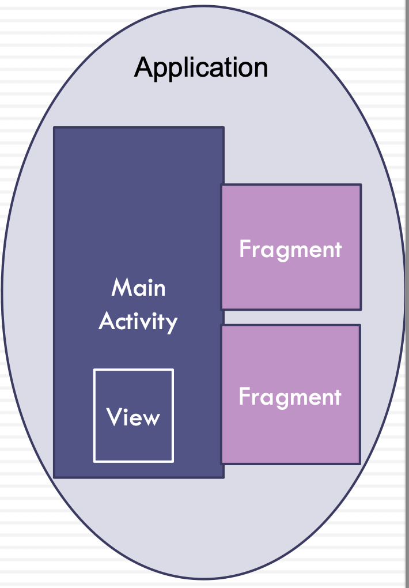

# Android Views and Intent

## Outline

- Views and Event Handling (Button example)
- View Binding
- Kotlin
- Intent and Multiple Activities
- Bundle
- Parcelable

## Events and Event Listeners

- Events are created from interactions with view objects like clicking a button
- Event Listeners can capture user interactions with UI
- An event listener is an interface in the View class
- An event listener contains a single callback method
  - Callback methods will be called when the View to which the listener has been registered is triggered by user interaction with the UI item
- View.OnClickListener is an event listener and its callback method is onClick()

**Event 事件**: User 和 Device 的所有交互都叫event, 点击，滑动屏幕，放大缩小等

**Event Listener 事件监听**:

在代码上抓取点击事件 -> 用代码编辑点击后边代表的逻辑

使用回调方法callBack() 来实现逻辑

    binding.clearButton.setOnClickListener(new View.OnClickListener() {
        @Override
        public void onClick(View v) {
            #onClick就是回调方法
            binding.editText.setText("");
        }
    }); 

<https://developer.android.com/reference/android/view/View.OnClickListener>

## View Binding

- View Binding was introduced recently by Android Jetpack
- It automatically creates a binding class for each XML layout file
- The auto-generated binding class implements ViewBinding
- ViewBinding is an interface that binds the views (e.g. a button) in a layout XML to their declared names (e.g. addButton)
- It provides an easier way to work with UI elements (views) instead of using findViewById
- To use View Binding, you must set view binding to true in the module level gradle file

## View Binding (cont’d)

Step 1: declare a private variable based on the name of the XML file using the PascalCase and add ‘Binding’ at the end, e.g. activity_main.xml becomes ActivityMainBinding

`private ActivityMainBinding binding;`

Step 2: create an instance of the binding class by invoking the static inflate() method to inflate the layout XML file (activity_main.xml) and create view objects from it

`binding = ActivityMainBinding.inflate(getLayoutInflater());`

Step 3: get a reference to the root view and pass it to setContentView() to make it the active view on the screen

    View view = binding.getRoot();
    setContentView(view);

Step 4: now we can access any views without using findViewById()

`binding.editMessage.setText("");`

<https://developer.android.com/topic/libraries/view-binding>

## View Binding Advantages

The advantages of View Binding over using findViewById():

- Reduces the boilerplate code
- Null Safety - View binding creates direct references to views so it eliminates the risk of a null pointer exception
- Type safety: The fields in each binding class have types matching the views, so it avoids a class cast exception

## Kotlin Properties

Properties in Kotlin classes are declared as var or val

Property Type is optional if it can be inferred from the initializer

E.g. var num = 1

- num has type Int and it is inferred here
- Kotlin’s default getter and setter

**var** is used for mutable properties, e.g. var message: String=“Hello"

**val** is used for read-only properties e.g. val message: String=“Hello"

Properties must be initialized or custom accessors must be provided

## Null Safety (Nullable types vs Non-null Types)

- Kotlin’s null safety aims to eliminate NullPointerException (NPE) of Java

- In Kotlin, a regular property cannot hold null (**non-null** types)

        var message: String=“Hello"
        message= null //generates an error at compile time

- To allow nulls and declare a property as **nullable**, we use ‘?’

        var message: String? =“Hello”
        message = null //it is now OK

  - When using nullable references:
  - Option 1: check for null in condition, e.g. if (message != null)
  - Option 2: use a safe call by using this symbol **?.**
  `println(message?.length)`
  - Option 3: Use the !! operator to convert any value to a non-null type and throw an exception if the value is null (behaves the same as Java)
  `val l = b!!.length`

## Lateinit Modifier

The **lateinit** modifier can be used with properties **declared as non-null** so they can be initialized later

- It can be only used on mutable (**var**) properties (not used with val)
- It **cannot** be used with a **primitive type**
- E.g. `private **lateinit** var binding: ActivityMainBinding`

## Kotlin Classes

- The primary constructor of a class can be part of the class header class
`class Person(var value: Double) { /*...*/ }`
- The primary constructor cannot contain any code so the initialization code is placed in initializer blocks, e.g. `**init**{ if(value<1) value=1.0 }`
- By default, Kotlin classes are final. To make a class inheritable, use the **open** keyword e.g. `**open** class Person`
- A single colon character ( : ) instead of the Java **extends** keyword
- No need for the **new** keyword, and to create a reference to an anonymous inner class, it uses **‘object’**
- In Kotlin,all methods are functions (fun)
- A colon **:** is used in the function for the return type, e.g. fun doubleIt(x: Int): Int { ...}

For more information refer to: <https://kotlinlang.org/docs/reference/>

## Multiple Activities

- Android applications can use multiple activities and multiple fragments
- When multiple activities are used, the first activity (MainActivity) starts the second activity using an **Intent**
- An Intent provides runtime binding between separate components, such as two activities

## Intent

- An Intent can be used to **start an activity**

  - The Intent constructor takes two parameters, a Context and a Class

    At the activity level:
    `Intent intent = new Intent(this, SecondActivity.class);`
    Inside the View block:

        Intent intent = new Intent(MainActivity.this, SecondActivity.class);
        startActivity(intent);

当然不仅仅是activity，安卓四大组件之间的跳转都能用Intent

**public Intent (Context, Class)**
For the first parameter we need to provide the current context.
The second parameter is the Class parameter, to which the system delivers the Intent (the activity we want to start)

- An intent can be used to **start a Service**

  - A Service is a component that performs operations in the background without a user interface (e.g. downloading a file)

- An intent can be used to start a **broadcast** (a message that any app can receive)
- An Intent can also be used to **pass data between activities**

## Passing Data

- When you have multiple activities you most likely need to pass data between them
- You can use objects of:
  - Intent
  - Bundle

### Using an Intent to Pass Primitive Data

- An intent not only allows you to start another activity, but it enables sending data to the other activity
- You can add extra data using the putExtra() method that requires two parameters (the key name and its value)
- putExtra() supports different types of data (see API), examples:

        intent.putExtra(String name, String value)
        intent.putExtra(Stringname,doublevalue)

- An example how to pass data using an intent in the first activity:

        Intent intent = new Intent(MainActivity.this, SecondActivity.class);
        intent.putExtra(“message”, msg);
        startActivity(intent);

### Getting Data from an Intent

- To get data from the intent in the second activity, first you need to use **getIntent( )**
  - e.g. `Intent intent=getIntent();`
- Then from the intent, you can retrieve the data that it is carrying by using a right method that matches the type of data
  - e.g. `String msg = intent.getStringExtra(“message”);`
- More examples of get methods:
  - public int getIntExtra (String name, int defaultValue)
    `int count = intent.getIntExtra(“count", 0);`

  - public double getDoubleExtra (String name, double defaultValue)
    `double price = intent.getDoubleExtra("price", 0.00);`

### Use Intent to Receive Results

- In the first activity, we use the **registerForActivityResult( )** API that:
  - takes two parameters: an **ActivityResultContract** and an **ActivityResultCallback**
  - returns an **ActivityResultLauncher** which is used to launch the second activity
- An **ActivityResultContract** defines the input type (Intent here) needed to produce a result
`public final class ActivityResultContracts.StartActivityForResult extends ActivityResultContract`

  - ActivityResultContracts.StartActivityForResult(): the Intent as an input and ActivityResult as an output
- An **ActivityResultCallback** is an interface with a single method, onActivityResult(), that takes an object of the output type defined in the ActivityResultContract

      ...
      private ActivityResultLauncher<Intent> startSecondActivity = registerForActivityResult(
        new ActivityResultContracts.StartActivityForResult(),
        new ActivityResultCallback<ActivityResult>() {
          @Override
          public void onActivityResult(ActivityResult result) { 
            if (result.getResultCode() == Activity.RESULT_OK) {
              Intent data = result.getData();
              String message=data.getStringExtra("message");
              binding.textView.setText(message); }
        } });
      ...

### Use Intent to Receive Results (cont’d)

- In the second activity, we invoke the **setResult() method** to set the result that will return to the first activity
  - void setResult (int resultCode, Intent intent), a result code can be the standard results RESULT_CANCELED, or RESULT_OK
  - You do not create a new Intent but use the one sent by the first activity Intent returnIntent = getIntent();
- Invoke the **finish() method** to close and destroy the activity after the result is sent to the caller

      ...
      Intent returnIntent = getIntent();
      String message= binding.editText.getText().toString(); 
      returnIntent.putExtra("message",message); 
      setResult(RESULT_OK,returnIntent);
      finish();
      ...

### Intent and Bundle

- With intents, to send a set of data items, you can use a Bundle

- "We recommend that you use the Bundle class to set primitives known to the OS on Intent objects. The Bundle class is highly optimized for marshalling and unmarshalling using parcels" - *Android Developer*

- Multiple data items can be added to one Bundle object and then it can be added to the Intent by calling `putExtras()`:

      Bundle bundle=new Bundle();
      bundle.putString(“name”, “Helen”);
      bundle.putString(“surname”, “Jones”);
      bundle.putString(“phone”, “9902000”);
      intent.putExtras (bundle);
      startActivity(intent);

- To retrieve the data from the bundle in the second activity:

      Bundle bundle=getIntent(). getExtras();
      String name=bundle.getString(“name”);

### Pass Objects between Activities

- We can pass objects between activities or processes as **Parcelable** objects, e.g. a student object if it is Parcelable

- An Android **Parcelable** is an interface that allows writing data and object references to a **Parcel** and then restoring it from a Parcel

- The object’s class must implement Parcelable

- The Parcelable objects can be added to a Bundle (and then added to an Intent) and passed between activities

 Bundle API <http://developer.android.com/reference/android/os/Bundle.html>
 Parcelable API <https://developer.android.com/reference/android/os/Parcelable.html>

### Passing Objects Using a Bundle

- To add a parcelable

      bundle.putParcelable (“student1", student);
      intent.putExtras(bundle);

- To retrieve a parcelable in the other activity

      Bundle bundle = getIntent().getExtras();
      bundle.getParcelable (“student1");

- But **this works only if the student class is Parcelable**

Object 传递需要把 java object 转换成 parcelable, parcelable 是一个类似 serializable 的序列化格式，但更高效，原理是bundle只接受序列化数据，不接受 java object

### Steps to Create Parcelable Class

How to make an object Parcelable:

1. The class **implements Parcelable**
2. Include **writeToParcel( )** to write values to the parcel in a specific order
3. Write a **constructor for reading** in values in the same order that you wrote
4. Add the **describeContents()** method
5. Add **a static field called CREATOR** that implements the Parcelable.Creator interface

you might also need to add:

- A second constructor with all the attributes
- All the getter and setter methods

<https://developer.android.com/reference/android/os/Parcelable>

### Parcelable Class: An Example

1. Create a class that implements Parcelable
2. Write the constructor for reading in values in the same order you wrote
3. Write writeToParcel()
4. Add describeContents()
5. Include a static field called CREATOR

- Add getters and setters
- Add a second constructor

      public class Student implements Parcelable { 

        private int id = 0;
        private String name = "";

        public Student(Parcel in) {
          this.id = in.readInt();
          this.name = in.readString(); 
        }

        public Student(int id, String name) { 
          this.id = id;
          this.name = name;
        }

        public void writeToParcel(Parcel parcel, int flags) {
          parcel.writeInt(id);
          parcel.writeString(name); 
        }

        public int describeContents() { 
          return 0;
        }

        public static final Creator<Student> CREATOR = new Creator<Student>() {
          @Override
          public Student createFromParcel(Parcel in) {
            return new Student(in); 
        }
        
        @Override
        public Student[] newArray(int size) {
          return new Student[size]; 
        }};

        public void setId(int id) { this.id = id;}
        public void setName(String name){ this.name = name;}
        public int getId(){ return id; }
        public String getName(){ return name; } 
        } 
      }

## Android Context

- **Context** is an abstract class whose implementation is provided by the Android system
- Context allows access to information about resources and classes
- An Activity is a subclass of Context
- In **an activity**, you have access to the application’s context by calling **getApplicationContext()** or access to the activity’s context via **MainActivity.this**
- Calling **getContext() on a View** in an activity returns the context that the view is running in, through which it can access the current resources
- **Fragments** do not subclass the Context class so you can call **getActivity()** to get access to the host activity’s context

## ScrollView

    <ScrollView
        xmlns:android="http://schemas.android.com/apk/res/android"
        xmlns:app="http://schemas.android.com/apk/res-auto"
        android:layout_width="match_parent"
        android:layout_height="match_parent"
        android:background="@drawable/background"
        android:gravity="center">
        #用于上下拉动页面

        <LinearLayout
          ......
        </LinearLayout>

    </ScrollView>
