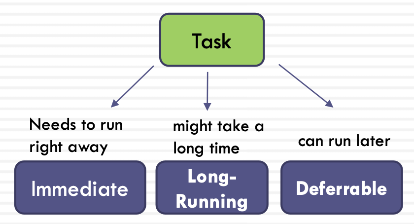
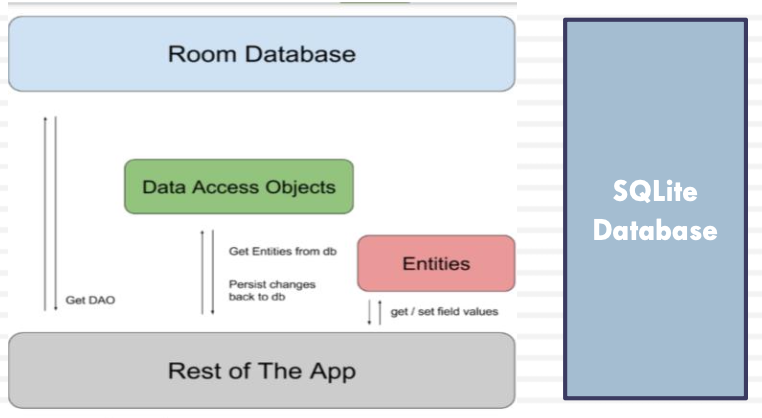
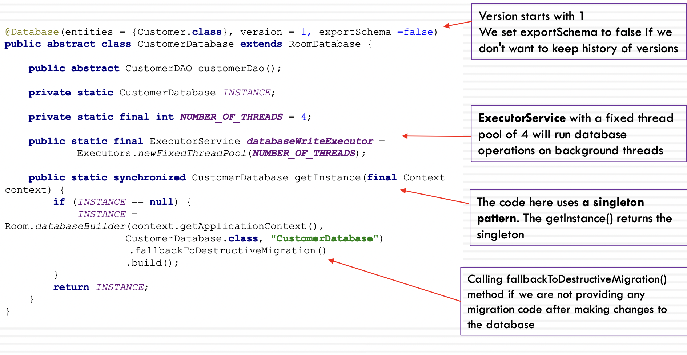
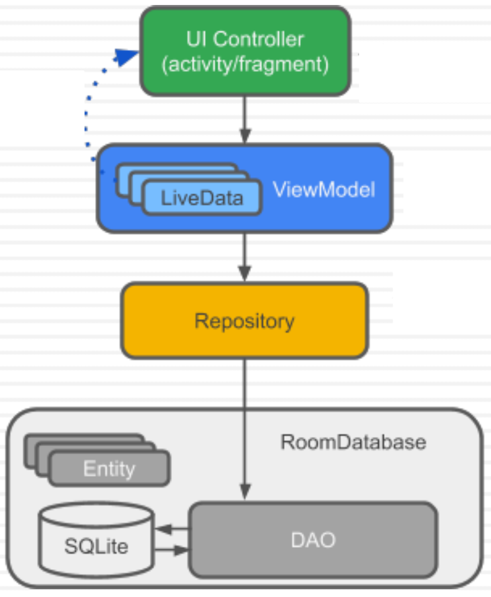
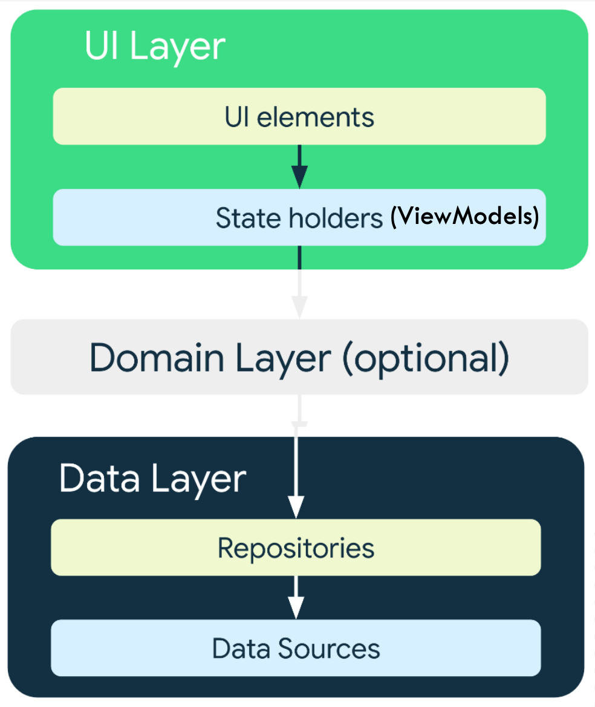
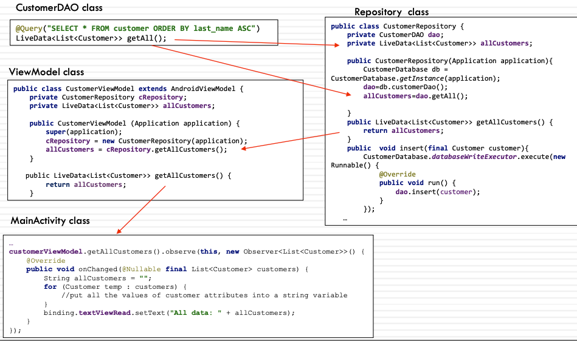

# Week 5 - Room

## Outline

- Threads
- Room Persistence Library
- Room with LiveData

## Single Thread Model

- When an Android application is launched, the system creates a ‘main’ thread, aka the ‘UI’ thread
- The main/UI thread is the single thread of execution for your application
- Two rules to Android's single thread model:
  - Rule 1: Do not block the main/UI thread
  - Rule 2: Do not access the Android UI toolkit from outside the UI thread (from a worker thread)

Process 进程:

- 每一个Android App 打开的时候，JVM提供一个进程并且下辖一个进程

- 每个进程下可以容纳多个线程

Thread 线程:

- 当App启动的时候，JVM提供main线程供MainActivity运行

- 也叫做主线程 == UI线程

- 线程的两条黄金定律:

  - 永远不要block UI线程(主线程) -- 新建线程后台运行
  - 永远不要从UI线程以外访问UI控件

### Rule 1: Do not block the UI thread

- If a task could take more than a few milliseconds (long-running tasks) should be processed on a background (worker) thread
- Long-running tasks cause the main (UI) thread to wait/block until the job is complete
- The app will hang, showing the Application Not Responding (ANR) dialog
- Examples of common long-running tasks include read/write data from/to a database, downloading files, running a machine learning algorithm, or making network connection and requests (http calls)

### Categories of background tasks

- Background work can be **Immediate**, **Long-Running** or **Deferrable**
- Background work can **persistent** or **impersistent**
- If the background work is persistent, use WorkManager
- If the background work is immediate and impersistent, use these options:
- Java’s ExecutorService or Kotlin’s coroutines
- Long-running and deferrable impersistent work: should be avoided

### Rule 2: Do not access the Android UI toolkit from outside the UI thread

- All the manipulations to the user interface should be done from the main/UI thread, and not from another thread
- The code below creates a new thread, and tries to access/modify the UI from a worker thread
- It violates Rule 2 by accessing the Android UI toolkit from outside the UI thread

      ...
      public void onClick(View v) {
        new Thread(new Runnable() { 
          public void run() {
            Bitmap b = loadImageFromNetwork("http://example.com/image.png"); 
            imageView.setImageBitmap(b);
          }
        }).start(); 
      }

### Solutions to Rule 2

Android offers several ways to use other worker threads without violating Rule 2:

1. runOnUiThread(Runnable), called from an activity
2. View.post(Runnable)
3. View.postDelayed(Runnable, long) //long: the delay (in milliseconds)
   - The runnable passed to these methods will run on the UI thread

## Room Persistence Library

- **Room Persistence library** is part of Android Jetpack
- Room provides an abstraction layer over SQLite that enables more robust database access
- SQLite provides a relational database management system for permanent storage of the structured data
- Using the SQLite APIs directly requires writing complex code, and using Helper and Cursor to access and manage data
- To reduce the effort to create and manage the SQLite database, **Room** was introduced

Room在SQLite上提供了一个抽象层，以便在发挥SQLite能力的同时允许流畅的数据库访问

针对SQLite的封装

使用简便

是耗时操作，**不能在UI Thread使用**

<https://developer.android.com/training/data-storage/room>

## Room Persistence Library (cont’d)

- To use Room, we need to include its libraries
- The Room’s Architecture Components are available from Google's Maven repository
- This repository is already included in the build.gradle (Project:package)

      repositories {
        google()
        mavenCentral() 
      }

- Then, we include the libraries in the build.gradle (Module:app) file under **dependencies**

      // Room
      implementation 'androidx.room:room-runtime:2.4.1' 
      annotationProcessor 'androidx.room:room-compiler:2.4.1'

Room Persistent Library consists of:

- **Database**: contains the database holder and has the access to the underlying persisted, relational data (SQLite database)
- **Entities**: represent tables within the database
- **DAO** (Data Access Object) classes
  - Contain query methods that offer abstract access to the database
  - Provide a mapping of SQL queries to methods such as insert or delete

## Entity Class

- **@Entity** marks a class as an entity
- For each entity, a table is created in the associate database
- The entity class provides a mapping to the SQLite table in the database
- Room uses the database table name for the class name by default
  - To change the table name, use the **tableName** property of the @Entity annotation
- Room uses the field/attribute names as the column names in the database
  - To change the column name, add the **@ColumnInfo** annotation to a field

e.g.1

    @Entity
    public class Person{ 
      @PrimaryKey
      public int pid;

      public String firstName;
      public String lastName; 
    }

e.g.2

    @Entity(tableName = “person_table")
    public class Person{
      @PrimaryKey
      public int pid; 
      
      @ColumnInfo(name = "first_name")
      public String firstName;

      @ColumnInfo(name = "last_name")
      public String lastName; 
    }

## Entity Class and Primary Key

- Each entity must have one **primary key** with the annotation @PrimaryKey
- If you want Room to assign automatic IDs to entities, set the autoGenerate property of @PrimaryKey
- To make the field persistent, Room must have access to it, either make them public (no need for getters and setters) OR private but add getters and setters for all fields including id

      @Entity
      public class Customer {

        @PrimaryKey (autoGenerate = true) 
        public int uid;

        @ColumnInfo(name = "first_name") 
        @NonNull
        public String firstName;

        @ColumnInfo(name = "last_name") 
        @NonNull
        public String lastName;

        public double salary;

        public Customer( @NonNull String firstName, @NonNull String lastName, double salary) {
          this.firstName=firstName; 
          this.lastName=lastName; 
          this.salary = salary;
        } 
      }

## Entity Class and Relationships

To create a one-to-many relationship between two entities:

- The child entity (Playlist) must include a variable that references the primary key of the parent entity (User)
- Create a new class (UserWithPlayLists) with a list of child entity instances (playlists)
- Add the **@Relation** annotation to the instance of the child entity (User)
- Set parentColumn to the primary key of the parent entity
- Set entityColumn to the child entity’s column referencing the parent entity's PK

Parent entity

    @Entity
    public class User {

      @PrimaryKey public long userId; 

      public String name;
      public int age;
    }

Child entity

    @Entity
    public class Playlist {

      @PrimaryKey public long playlistId; 

      public long userCreatorId;
      public String playlistName;
    }

UserWithPlayLists

    public class UserWithPlaylists { 
      @Embedded public User user;

      @Relation(
        parentColumn = "userId", 
        entityColumn = "userCreatorId"
      )

      public List<Playlist> playlists;
    }

## DAO (Data Access Object)

- A DAO includes methods that offer abstract access to the Database
- By accessing a database using a DAO class instead of direct queries, we can separate different components of the database
- Examples of DAO methods:

  - **@Insert**
  - **@Update**
  - **@Delete**
  - **@Query**

DAO和数据库直连，里面写都是sql语句

DAO中拿出的数据通过Repository将数据映射为java中的entity

ViewModel（连接前后端）将repository中的java对象转化成前端UI

### Example

    @Dao
    public interface CustomerDAO {

      @Query("SELECT * FROM customer ORDER BY last_name ASC")
      LiveData<List<Customer>> getAll();

      @Query("SELECT * FROM customer WHERE uid = :customerId LIMIT 1")
      Customer findByID(int customerId); 
      
      @Query("DELETE FROM customer")
      void deleteAll(); 
      
      @Insert
      void insert(Customer customer); 
      
      @Delete
      void delete(Customer customer); 
      
      @Update
      void updateCustomer(Customer customer);

    }

### @insert

- The @Insert annotation marks a method in a DAO as an insert method
- The parameter passed into the Insert method must be a class annotated with Entity or a collection/array of that entity
- If the @Insert method receives only one parameter, it can return the new rowId as long, and if the parameter is an array or a collection, it will return `long[]` or `List<Long>`

      @Insert
      void insertUsers(User user);
      @Insert
      void insertUsers(User... users);

      @Insert
      long insertUsers(User user);
      @Insert
      List<Long> insertUsers(User... users);

### @delete

- @delete marks a method as a delete method
- The implementation of the method will delete the parameter(s) passed to the method from the database
- It uses the primary keys to find the entities to delete
- The method can return an int value instead, i.e. the number of rows removed from the database

      @Delete
      void deleteUser(User user);

      @Delete
      void deleteUsers(Users ... users);

### @update

- The update modifies the method’s parameter(s) if they already exist (checks using **the primary key**)
- The parameter passed into the Insert method must be a class annotated with Entity or a collection/array of that entity
- The method can return an int value instead, i.e. the number of rows updated in the database

      @Update
      void updatePerson(Person person);

      @Update
      void updatePersons(Person... persons);

### OnConflictStrategy

- With the CRUD operations’ annotations, you can use the conflict strategies
- The **default strategy** is OnConflictStrategy.**ABORT** to roll back the transaction on conflict
- Other two options for the insert DAO method:
  - OnConflictStrategy.**IGNORE** will ignore the row if a conflict occurs
  - OnConflictStrategy.**REPLACE** will insert a row even if there is a conflict (replaces the existing row with the new row)

        @Insert(onConflict = OnConflictStrategy.REPLACE) 
        public void insertUsers(User... users);

### @query

- In addition to the @insert, @update and @delete, we can perform **read/write operations** on a database using the **@query** annotation
- Queries could include **SELECT**, **UPDATE** and **DELETE**
- The query code is checked at compile time, so if there is a problem (e.g. if field names do not match), a compilation error occurs instead of a runtime failure

      @Query("SELECT * FROM customer") 
      List<Customer> getAll();

      @Query("SELECT * FROM customer ORDER BY last_name ASC") 
      LiveData<List<Customer>> getAll();

      //this query is used to delete all records
      @Query("DELETE FROM customer")
      void deleteAll();

### @query (cont’d)

To pass parameters to the query, you need to use a colon : before the parameter name

    @Query("SELECT * FROM customer WHERE uid = :customerId LIMIT 1") 
    Customer findByID(int customerId);

    @Query("UPDATE customer_table SET first_name=:firstName WHERE cid = :id") 
    void updateName(String firstName, int id);

    @Query("UPDATE customer SET first_name=:firstName, last_name=:lastName, salary=:salary WHERE uid = :id")
    void updatebyID(int id, String firstName, String lastName, double salary);

### @Database

A database class meets these criteria:

1. To be an abstract class that extends RoomDatabase
`public abstract class CustomerDatabase extends RoomDatabase {`

2. To include the list of entities of the database within the @Database annotation
`@Database(entities = {Customer.class}, version = 1, exportSchema =false)`

   - **version** - After creating the database, if you decide to make changes to its schema, you must increment **the version number** (e.g. if it was version 1 it becomes version 2)
   - **exportSchema** - By default, **exportSchema** is set to true to keep version history of the database schema but it requires providing its details (location) in the module level gradle file OR you can set it to false if you do not want to keep history of versions

3. To contain an abstract method with no argument, returning an instance of the DAO class
`public abstract CustomerDAO customerDao();`

4. An instance of Database based on **the singleton pattern** is created to prevent having multiple instances of the database opened at the same time

        private static CustomerDatabase INSTANCE;
        public static synchronized CustomerDatabase getInstance(final Context context) { 
          if (INSTANCE == null) {
            INSTANCE = Room.databaseBuilder(context.getApplicationContext(), 
            CustomerDatabase.class, "CustomerDatabase")
            .build();
          }
          return INSTANCE; 
        }

a) The method signature to create a **RoomDatabase.Builder**
`public static Builder<T> databaseBuilder (Context context, Class<T> klass, String name)`

b) The **build()** method is invoked on the Builder to return a new database instance

c) context.**getApplicationContext()** is used as a Context in getInstance() to return the global context of the current application

5. To run database operations on worker/background threads, we use an **ExecutorService** with a fixed thread pool (to allow the reuse of previously created threads to execute multiple data requests)

`private static final int NUMBER_OF_THREADS = 4;`
`public static final ExecutorService databaseWriteExecutor = Executors.newFixedThreadPool(NUMBER_OF_THREADS);`

1. To handle the migration if the database schema changes

### Migrating Room databases

- To increment the version number after making changes to the schema
  `@Database(entities = {Customer.class}, version = 2, exportSchema =false)`
- Additionally, you need to provide migration instructions/code. The migration code will be used to preserve your previous data in the database after migration/upgrade

<https://developer.android.com/training/data-storage/room/migrating-db-versions>

- If you want to clear all data and start from the scratch you can use invoke the **fallbackToDestructiveMigration()** method

      //database instance created by calling Room.databaseBuilder()
      CustomerDatabase database = Room.databaseBuilder(context.getApplicationContext(),
      CustomerDatabase.class, "CustomerDatabase")
        .fallbackToDestructiveMigration()
        .build();

### Example

### Where is the database?

- You can view the database In the Device File Explorer window
- Find the database under the application package data/data/application package/databases

## Room, LiveData and ViewModel

The Repository is not part of the Room library architecture but is recommended to provide code separation and a ‘clean API’

Source: <https://developer.android.com/codelabs/android-room-with-a-view#1>

Source:<https://developer.android.com/jetpack/guide#recommended-app-arch>

## Repository

- The Repository is responsible to manage query threads, i.e. the ExecutorService and its pool of threads that were added in the Database class
- The DAO instance in the Repository class provides access through it to all the read/write methods for the database

      public class CustomerRepository {

        private CustomerDAO dao;
        private LiveData<List<Customer>> allCustomers; 
        private Customer customer;

        public CustomerRepository(Application application){

          CustomerDatabase db = CustomerDatabase.getInstance(application); 
          dao=db.customerDao();
          allCustomers=dao.getAll(); 
        }

        public LiveData<List<Customer>> getAllCustomers() {
          return allCustomers;
        }
        public void insert(final Customer customer){
          CustomerDatabase.databaseWriteExecutor.execute(new Runnable(){
            @Override
            public void run() { 
              dao.insert(customer);  //Each R/W method uses ExecutorService (databaseWriteExecuter) 
                                      to execute the database operations on a background thread 
                                      (not on the main thread)
            }
          });
      }...

## Room and LiveData

- Using LiveData with Room, we can implement **the observer design pattern**
- Room generates all the necessary code to update the LiveData object when a database is updated, and the UI gets automatically updated too
- We use **observable queries** that are written as part of a DAO class to implement this
  - The observed LiveData will automatically notify the observer on the main thread each time the data changes

        @Dao
        public interface CustomerDAO {
          @Query("SELECT * FROM customer ORDER BY last_name ASC") 
          LiveData<List<Customer>> getAllCustomers();
          ...

- The next steps are creating the ViewModel class and implementing the observer in the activity (or the fragment)

## Room and ViewModel

- The ViewModel class here extends **AndroidViewModel**, not ViewModel
- AndroidViewModel extends ViewModel and must have a constructor which accepts **Application** as the only parameter
- In this class, we need:
  - A constructor that accepts the application, creates the repository, and initializes LiveData (customer)
  - A get method to return the LiveData
  - Wrapper methods for insert, delete and update methods

        public class CustomerViewModel extends AndroidViewModel {

          private CustomerRepository cRepository;
          private LiveData<List<Customer>> allCustomers;

          public CustomerViewModel (Application application) { 
            super(application);
            cRepository = new CustomerRepository(application); 
            allCustomers = cRepository.getAllCustomers();
          }
          public LiveData<List<Customer>> getAllCustomers() { 
            return allCustomers;
          }
          public void insert(Customer customer) { 
            cRepository.insert(customer);
          }
          public void deleteAll() {
            cRepository.deleteAll(); 
            }
          public void update(Customer customer) { 
            cRepository.updateCustomer(customer);
          } 
        }

In the Repository class

    public CustomerRepository(Application application){ 

      CustomerDatabase db = CustomerDatabase.getInstance(application);

      dao=db.customerDao(); 

      allCustomers=dao.getAll(); 
    }

## Main Activity

- How to create the view model and implement the observer?
- To create the view model, we need to use ViewModelProvider and its factory
  - ViewModelProvider uses two different types of factories for creating a ViewModel or an AndroidViewModel. We need to use the **AndroidViewModelFactory** for creating AndroidViewModel that accepts the application as a parameter

`customerViewModel=ViewModelProvider.AndroidViewModelFactory.getInstance(getApplication()) .create(CustomerViewModel.class);`

- Implement the observer by invoking the observe() method on the LiveData

      customerViewModel.getAllCustomers().observe(this, new Observer<List<Customer>>() { 
        @Override
        public void onChanged(@Nullable final List<Customer> customers) { 
          for (Customer temp : customers) {
              // get details of each customer 
          }
          //display customer details in the UI 
      } });

- Use the view model reference to perform insert, delete or update

      customerViewModel.insert(customer);
      customerViewModel.deleteAll();

## Room and LiveData

## CompletableFuture

**CompletableFuture<T>** is a class that implements the Future interface

It has two main methods:

- **CompletableFuture.supplyAsync( )**: If we want to run some background task asynchronously and do want to return anything from that task
- **CompletableFuture.runAsync( )**: If we want to run some background task asynchronously and do NOT want to return anything from that task
  - static CompletableFuture<T> supplyAsync(Supplier<T> supplier, Executor executor)
    - Tasks are executed on the background threads obtained from a provided thread pool using ExecutorService
  - We must implement the get() method of the Supplier<T> that will return the result

Repository.java class

    public CompletableFuture<Customer> findByIDFuture(final int customerId) { 
      return CompletableFuture.supplyAsync(new Supplier<Customer>() {
        @Override
        public Customer get() {
          return dao.findByID(customerId);
          }
      }, CustomerDatabase.databaseWriteExecutor); }

- Then later, we can use the callback methods:
  - **thenApply()** if we expect results
  - **thenAccept()** if we don’t expect results to be returned

MainActivity.java class

    CompletableFuture<Customer> customerCompletableFuture = customerViewModel.findByIDFuture(id);

    //to get the customer object returned from CompletableFuture
    customerCompletableFuture.thenApply(customer -> { 
      if (customer != null) {
        customer.firstName = name;
        customer.lastName = surname;
        customer.salary = salary;
        customerViewModel.update(customer);
        binding.textViewUpdate.setText("Update was successful for ID: " + customer.uid);
      } else {
          binding.textViewUpdate.setText("Id does not exist");
      }
      return customer; 
    });