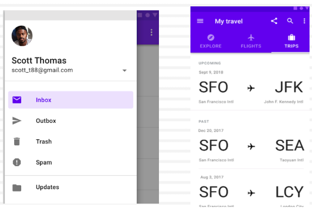
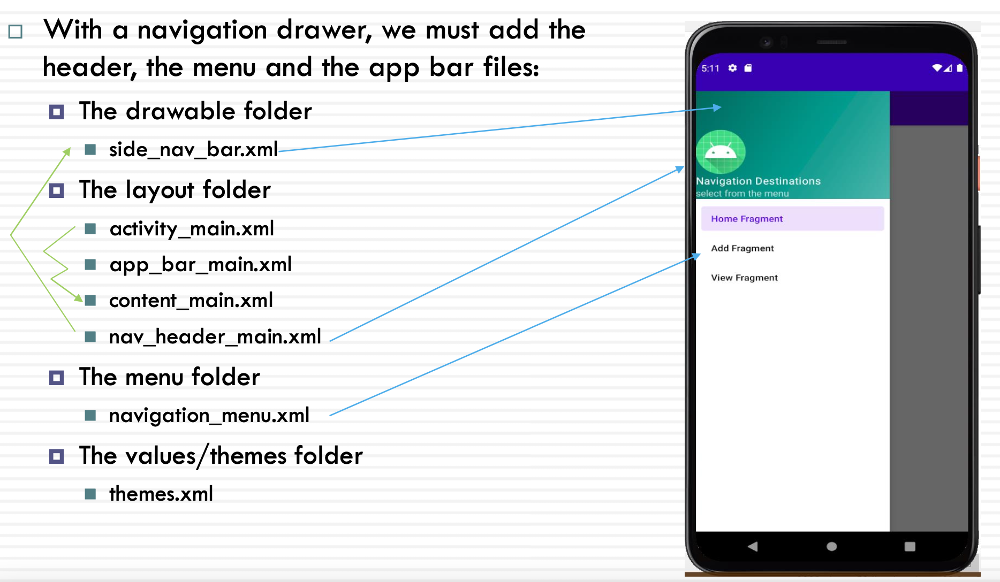

# Week 6 - Android Navigation

## Outline

- Navigation in Material Design
- Navigation Drawer
- Jetpack Navigation Components
  - NavigationUI
  - NavHost
  - NavController
  - Navigation Graph

## Material Design - Navigation

- Material is a design system created by Google
- Three types of navigation suggested in Material Design

  1. Lateral navigation
  2. Forward navigation
  3. Reverse navigation

***

- 页面跳转控件

- 在 create new project 时候会提供自动生成的 含有 navigation view的activity

  - Bottom Naviagation Activity

  - Navigation Drawer Activity

  - 通常作为 mainActivity 使用

- Navigation 不是唯一的页面跳转的控件

### Lateral Navigation

Lateral Navigation occurs between screens at the same level of hierarchy

- **Navigation Drawer**, Tabs, or Bottom Navigation

### Forward Navigation

- **Downward** from a parent screen to a child screen
- **Sequentially** through a flow
- **Directly** from one screen to any other in the app  Implemented using:
  - Cards or lists
  - Buttons that lead to another screen
  - In-app search on one or more screens
  - Links within the content

### Reverse Navigation

Reverse chronological navigation

- Navigating in reverse order
- Back Button in the Android navigation bar
- Back Button in a web browser

Upward navigation

- Navigate one level upwards within a hierarchy
- An Up action

## Navigation Drawer

**Standard navigation** drawers allow interaction with both screen contents and the drawer at the same time

- **Permanently visible drawer**: has a fixed position on the screen
  - They are suitable for tablets and desktop computers
- **Dismissible drawer**: can be opened and closed (with **an inlay style**)

### Navigation Drawer Types: Modal and Bottom Drawers

- **Modal drawers** overlay the content and block interaction, suitable for mobile phones with limited screen sizes
- **Bottom drawer** is a type of modal drawer that opens from the bottom of the screen rather than the side

## Android Navigation Drawer

- The navigation drawer is a UI panel that allows navigation between top level destinations through displaying a navigation menu
- The navigation drawer appears when the user touches the drawer icon in the app bar
- **NavigationView** and the Android **Navigation component** are used to create a navigation drawer
- There are certain key components of a navigation drawer such as the header, menu, and app bar as the XML files that we need to create

## Navigation Drawer Components

### The Header of the Drawer

The header area of a navigation drawer is a space that can be used to include an image (logo/icon) and a title.

layout/nav_header_main.xml

    <?xml version="1.0" encoding="utf-8"?>
    <LinearLayout 
    xmlns:android="http://schemas.android.com/apk/res/android"
    xmlns:app="http://schemas.android.com/apk/res-auto" 
    android:layout_width="match_parent" 
    android:layout_height="176dp“

    android:background="@drawable/side_nav_bar“

    android:gravity="bottom"
    android:orientation="vertical" 
    android:theme="@style/ThemeOverlay.MaterialComponents.Dark"> 
    
    <ImageView
      android:id="@+id/imageView" 
      android:layout_width="wrap_content" 
      android:layout_height="wrap_content" 
      app:srcCompat="@mipmap/ic_launcher_round" />

    <TextView
      android:layout_width="match_parent"
      android:layout_height="wrap_content"
      android:text="Navigation Destinations"
      android:textAppearance="@style/TextAppearance.MaterialComponents.Body1" />

    <TextView
      android:id="@+id/textView" 
      android:layout_width="wrap_content" 
      android:layout_height="wrap_content" 
      android:text="select from the menu" />

side_nav_bar.xml

    <?xml version="1.0“ encoding="utf-8"?> 
      <shape android:shape="rectangle“
    xmlns:android="http://schemas.android.com/apk/res/android">
      <gradient 
        android:type="linear"
        android:startColor="#4DB6AC" 
        android:endColor="#00695C" 
        android:centerColor="#009688" 
        android:angle="135"/>
    </shape>

### res/menu/navigation_menu.xml

navigation_menu.xml

    <?xml version="1.0" encoding="utf-8"?>
    <menu xmlns:android="http://schemas.android.com/apk/res/android"
      xmlns:tools="http://schemas.android.com/tools"> 

      <item
        android:id="@+id/nav_home_fragment"
        android:title="Home Fragment" /> 
      
      <item
        android:id="@+id/nav_add_fragment"
        android:title="Add Fragment" /> 
      
      <item
        android:id="@+id/nav_view_fragment" 
        android:title="View Fragment" />
    </menu>

### activity_main.xml and NavigationView

- **NavigationView** represents a navigation menu for the application
- We usually place the NavigationView inside a **DrawerLayout**
- DrawerLayout is a top-level container that allows for the drawer view to emerge from an edge of the window
- NavigationView displays **menu** items as a vertical list, and a **header** view above the menu
  - It includes a reference to the drawer’s header and menu XML files
- activity_main.xml includes app_bar_main.xml

activity_main.xml

    <?xml version="1.0" encoding="utf-8"?> 
    <androidx.drawerlayout.widget.DrawerLayout 
    xmlns:android="http://schemas.android.com/apk/res/android"
      xmlns:app="http://schemas.android.com/apk/res-auto" 
      android:id="@+id/drawer_layout" 
      android:layout_width="match_parent" android:layout_height="match_parent">
    
    <include
    layout="@layout/app_bar_main" 
    android:layout_width="match_parent" 
    android:layout_height="match_parent" />

    <com.google.android.material.navigation.NavigationView 
    android:id="@+id/nav_view"
    android:layout_width="wrap_content" 
    android:layout_height="match_parent" 
    android:layout_gravity="start" 
    app:headerLayout="@layout/nav_header_main" 
    app:menu="@menu/navigation_menu" />

    </androidx.drawerlayout.widget.DrawerLayout>

### The app bar of the Navigation Drawer

Toolbar is placed inside the AppBarLayout (a powerful, vertical LinearLayout with additional features and gestures) to enable the right interactions for the drawer and toolbar
• AppBarLayout is placed inside the CoordinatorLayout, a container for enabling complex interactions with child views