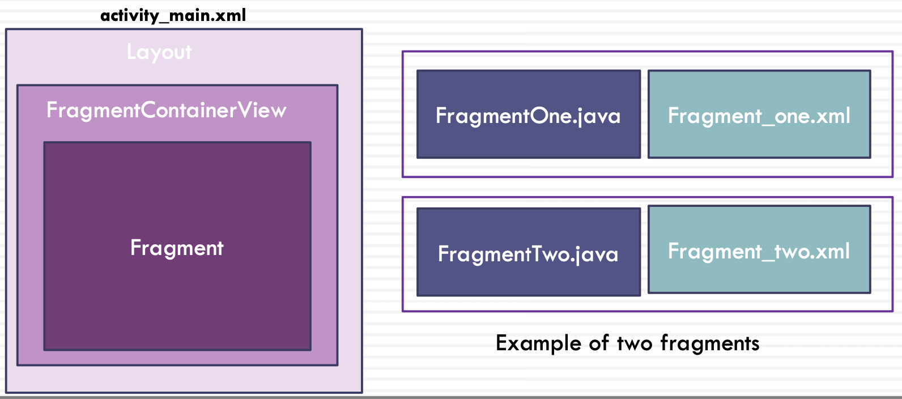
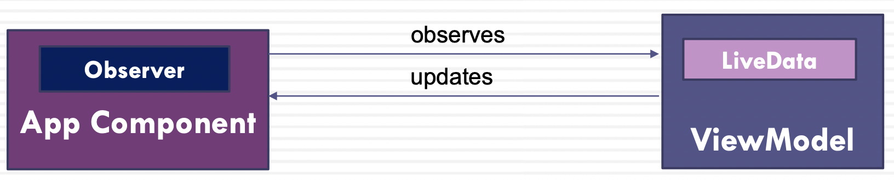
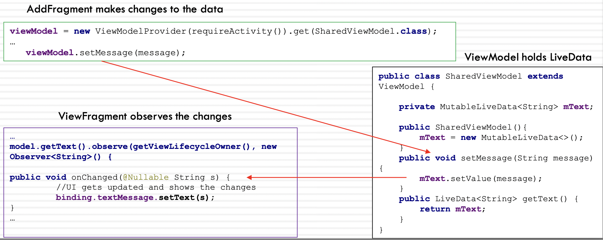

# Week 4 - Fragment and Livedata

## Outline

- Fragments
- Loading fragments
- Passing data between fragments
- SharedPreferences
- LiveData and ViewModel
- Fragments - Kotlin version

当销毁一个页面的时候，需要新建一个类将数据保存，存数据的两种方式: SP和livedata, SP是永久储存，livadata是短暂储存，当关闭activity, livedata就清空了。如果数据量比较少且需要经常储存，就用SP。数据量大且一直需要更新的数据就放到livedata里。

## Fragment

- A fragment are used to build parts of an app’s user interface
- A fragment has its own layout and lifecycle
- A fragment must be hosted in an activity
- The fragment has a view hierarchy that attaches to the host’s view hierarchy
- Fragments provide reusability and modularity
- Using fragments, it is easier to dynamically modify the activity’s appearance

是一个迷你的activity，也可以实现view和逻辑

有自己的生命周期，不过和调用此fragment的activity息息相关

每一个fragment在使用时都必须和一个activity绑定

可以复用

模块化必要的组成部分

可控性: 更好的传递参数

- We use this support version: **androidx.fragment.app.Fragment**
- androidx.fragment.app.Fragment is the static library support version of the framework's android.app.Fragment (the old Support library that was deprecated)
- In the module level gradle, add the dependency
`implementation 'androidx.fragment:fragment:1.4.0'`

### Fragment lifecycle

- A fragment has its own lifecycle that is directly affected by its host activity's lifecycle
- When a fragment is created it will be added to a **FragmentManager**
- The Fragment class has two callback methods:
  - **onAttach( )** is called when the fragment is added to a FragmentManager and attached to its host activity
  - **onDetach( )** is called when the fragment is removed from a FragmentManager and detached from its host activity
- FragmentManager is responsible for attaching fragments to their host activity and detaching them

<https://developer.android.com/guide/fragments/lifecycle>

**onAttach( )**: Fragment和Activity相关联时调用

- 可以通过该方法获取Activity引用，还可以通过getArguments()获取参数

**onCreate( )**: Fragment被创建时调用

**onCreateView( )**: 创建Fragment的布局

**onViewCreated( )**: Observe live data and update view

**onViewStateRestored()**: 调取onSaveInstanceState()存储的view

**onStart( )**: 当Fragment可见时调用

**onResume( )**: 当Fragment可见且可交互时调用

- 和onPause相对，对话框消失时激活

**onPause( )**: 当Fragment不可交互但可见时调用。--弹出对话框

**onStop( )**: 当Fragment不可见时调用

**onSaveInstanceState( )**: 存储当前view

**onDestroyView( )**: 当Fragment的UI从视图结构中移除时调用

**onDestroy( )**:销毁Fragment时调用

**onDetach( )**:当Fragment和Activity解除关联时调用

### Fragment Class and Fragment XML Layout

- The host activity of a Fragment must extend FragmentActivity or AppCompatActivity (its subclass)
- Fragments must be hosted inside a container (FragmentContainerView)

### To Create a Fragment

A fragment is created by extending the Fragment class from androidx.fragment.app.Fragment

- E.g. public class ViewFragment **extends Fragment** {

To provide a user interface for a fragment:

1. You need to create a layout XML file for the fragment (e.g. home_fragment.xml)
2. In the fragment class, you must implement the **onCreateView()** method and call the **inflate()** method to return the View to draw a UI for the fragment
   - The inflate() method inflates a new view hierarchy from the specified XML node, converting it into its corresponding views and viewGroups

### Create a Fragment (with View Binding)

- The **inflate()** method is invoked to create an instance of the binding class
- Calling the **getRoot()** method returns a reference to the root view that the onCreateView() method must return to make it the active view on the screen
- Since Fragments outlive their views and onDestroy() is called after onDestroyView() we call **onDestroyView()** to clean up any references to the binding class

        public class ViewFragment extends Fragment {
            private ViewFragmentBinding binding;
            public ViewFragment(){}
            @Override
            public View onCreateView(LayoutInflater inflater, ViewGroup container, Bundle savedInstanceState) 
            {
                binding = ViewFragmentBinding.inflate(inflater, container, false);
                View view = binding.getRoot();
                return view;
            }
            @Override
            public void onDestroyView() { 
                super.onDestroyView(); 
                binding = null;
        }}

**boolean attachToRoot**
We set the attachToRoot to false so it will return the correct view that was created from inflating the layout file. If we set it to true, the layout file specified is inflated and attached to the root of parent (the ViewGroup) and will return an incorrect View. Later the view will be attached to the root so we avoid attaching it twice.

### FragmentContainerView

- FragmentContainerView is a customized Layout for Fragments
  - It extends FrameLayout (used in the previous versions)
- FragmentContainerView works like a container for Fragments

所有的Fragment建议都存在FragmentContainerView中

使用时直接放置在layout中

activity_main.xml

    <?xml version="1.0" encoding="utf-8"?>
    <LinearLayout
        xmlns:android="http://schemas.android.com/apk/res/android"
        android:layout_width="match_parent"
        android:layout_height="match_parent"
        android:orientation="vertical">
    
        <Button
            android:id="@+id/addButton" 
            android:layout_width="match_parent" 
            android:layout_height="wrap_content" 
            android:text="AddFragment" 
            android:textSize="20sp" />

        <Button
            android:id="@+id/viewButton" 
            android:layout_width="match_parent" 
            android:layout_height="wrap_content" 
            android:layout_marginTop="10dp" 
            android:text="ViewFragment" 
            android:textSize="20sp" />

        <androidx.fragment.app.FragmentContainerView 
            android:id="@+id/fragment_container_view" 
            android:layout_width="match_parent"
            android:layout_height="match_parent" 
            android:layout_marginTop="10dp" />

    </LinearLayout>

<https://developer.android.com/reference/androidx/fragment/app/FragmentContainerView>

### How to Load Fragments - Fragment Manager

- To add or replace fragments in the activity, we use **FragmentManager** and **FragmentTransaction**
- FragmentManager is responsible for attaching fragments to their host activity and detaching them when the fragment is no longer in use
- Calling the **replace()** method removes an existing fragment in a container and replaces it with an instance of a new fragment class
- The **add()** method will not remove the previous fragment

        FragmentManager fragmentManager = getSupportFragmentManager
        FragmentTransaction fragmentTransaction = fragmentManager beginTransaction();
        fragmentTransaction.replace(R.id.fragment_container_view, nextFragment);
        fragmentTransaction.commit();

 A more concise way of a stack of operations

    getSupportFragmentManager().beginTransaction()
                               .replace(R.id.fragment_container_view, nextFragment) 
                               .commit();

## How to pass data between fragments?

- SharedPreferences
- LiveData

### Shared Preference

- SharedPreferences enable to save and retrieve simple values as key-value pairs
- A SharedPreferences object points to an XML file containing key-value pairs and provides simple methods to read and write them
- It is a suitable way to store and access data if you do not need to store a large amount of data and there is no need for a structure
- It is an easy way to pass data between fragments

Android平台上一个轻量级的存储类(持久类储存)

本地XML(Key-value格式)文件，用来保存应用的一些常用配置

作业里我们可以保存登录的用户信息(用户信息加密，密码加密)

fragment /activity 跳转时候的储存地址

可进一步封装提升代码可读性和聚合性

<https://developer.android.com/training/data-storage/shared-preferences>

### To Create SharedPreferences

- To create a SharedPreference file, we first invoke the getSharedPreferences() method
`Context.getSharedPreferences(String, int)`

        SharedPreferences sharedPref = 
        requireActivity().getSharedPreferences(“PREFERENCE_FILE_NAME",Context.MODE_PRIVATE);
        // 初始化SP，key代表这个SP的表名，mode是这个sp允许的访问范围

- The **requireActivity()** method returns a FragmentActivity, i.e. the host activity that the fragment is associated with, and since a FragmentActivity is a subclass of Context, we can call its method, getSharedPreferences()
  - We can use **getActivity()** or **requireActivity()** to return a FragmentActivity and the difference is that requireActivity() will throw the IllegalStateException if the fragment is not associated with an activity or context
- The **getSharedPreferences()** method requires a file name and an operating mode (the default is MODE_PRIVATE)

<https://developer.android.com/training/data-storage/shared-preferences#java>

### To Write to SharedPreferences

- To write to a SharedPreferences file, we need to create a **SharedPreferences.Editor** interface by calling **edit()** on your SharedPreferences

      SharedPreferences.Editor spEditor = sharedPref.edit();
      spEditor.putString(“message", message);
      spEditor.apply();

- You can add key-value pairs also using putInt(), putBoolean(), putFloat(), putLong(), putStringSet()
- All changes that are made using the editor are batched, and not written to the SharedPreferences file until you call **commit()** or **apply()**
  - The commit() method returns a Boolean value true if successful

### To Read From SharedPreferences

To read/retrieve values from a shared preferences file, you can call methods like getString(), and provide the key to get the associated value

      SharedPreferences sharedPref= requireActivity().
                                    getSharedPreferences("FileName", Context.MODE_PRIVATE);
      String message= sharedPref.getString("message",null);
      //不用apply或者commit

String getString (String key, String defValue)

- defValue: the value to return if this preference does not exist. This value may be null.

### Where Are SharedPreferences Stored?

- Open Device File Explorer and make sure the right emulator selected
- SharedPreferences are stored as an xml file under data/data/yourapplication/shared_prefs

## LiveData

- LiveData is one of architecture components in Android Jetpack
- LiveData is a data holder class (an abstract class) that can be observed, **using the observer pattern**
- LiveData allows **observers** to subscribe to updates and when the data held by the LiveData object changes, observers will be notified
- A class (an activity or a fragment) can implement the Observer interface when it wants to be informed of changes in observable objects
- LiveData is **lifecycle-aware**
  - LiveData updates app component observers that are in an active lifecycle state

<https://developer.android.com/topic/libraries/architecture/livedata>

暂时存储数据的一种class格式

可以implement observe观察方法，来监听数据的改变，其call back method是onChanged()

使用其子类MutableLiveData来改变live data中的数据 (setValue()，postValue())

### LiveData and ViewModel

- An instance of LiveData is usually created within the ViewModel class
- LiveData object (that holds the data) is stored within a ViewModel object and is accessed via a getter method
- LiveData allows observers in app components such as an activity or a fragment to observe updates, and get notified of changes

跨fragment生存的一种暂时存储数据的object类，和activity绑定

通常hold live data object

使用场景举例:

- 执行耗时操作时，可以使view model和fragment/activity脱离，后台下载

- 横竖屏切换时，fragment会经历销毁和重建，而储存在view model中的数据不会销毁

### ViewModel

- ViewModel is part of Android Jetpack
- ViewModel prepares and manages the data for a fragment or an activity
- ViewModel is active and running, while an activity can be in any of its lifecycle states
- ViewModel retains the data – it is not destroyed during the configuration changes e.g. when rotating the device that destroys and recreates its owner (an activity or a fragment)

<https://developer.android.com/reference/androidx/lifecycle/ViewModel>

### LiveData and MutableLiveData

- **LiveData** is an abstract class and cannot be instantiated
- **MutableLiveData** extends LiveData but is not an abstract class
- LiveData provides no method to modify its data
- MutableLiveData provides two public methods **setValue()** and **postValue()** to modify its data
  - setValue() must be called from the main thread
  - postValue() is used when you need set a value from a background thread

### How to Use LiveData

1. Add the lifecycle dependencies to the build.gradle file

        implementation 'androidx.lifecycle:lifecycle-viewmodel:2.4.0'
        implementation 'androidx.lifecycle:lifecycle-livadata:2.4.0'

2. Create a **ViewModel class** that provides access to the LiveData
3. Declare and instantiate an instance of **MutableLiveData** so we can update data by calling the **setValue()** method of MutableLiveData
4. Add the public **getText()** method to get the **LiveData**

        public class SharedViewModel extends ViewModel {

            private MutableLiveData<String> mText;

            public SharedViewModel(){
                mText = new MutableLiveData<>();
            }

            public void setMessage(String message) {
                mText.setValue(message);
            }

            public LiveData<String> getText() {
                return mText;
        }}

5. To create an instance of a ViewModel we will invoke the **get()** method on androidx.lifecycle.**ViewModelProvider**

        //in a fragment you use requireActivity
        SharedViewModel viewModel = new ViewModelProvider(requireActivity()).get(SharedViewModel.class);

        //in an activity
        SharedViewModel viewModel = new ViewModelProvider(this).get(SharedViewModel.class);

- The parameter of the **get()** method is the class of the ViewModel that we want to create an instance of it
- Creating the **ViewModelProvider** requires a **ViewModelStoreOwner**
  - ViewModelProvider(ViewModelStoreOwner owner)
  - MainActivity.java extends AppCompatActivity that is a subclass of FragmentActivity which implements the ViewModelStoreOwner interface

6. To make the main activity or a fragment an **Observer**, we invoke the **observe()** method on the LiveData object

- The observe() method takes two parameters: a LifecycleOwner and an Observer
  - AppCompatActivity is a subclass of ComponentActivity and ComponentActivity implements LifecycleOwner

6. This requires implementing the **onChanged()** method that is called when the LiveData changes

        //in a fragment we use getViewLifeCycleOwner and in an activity we use ‘this’

        viewModel.getText().observe(getViewLifecycleOwner(), new Observer<String>() { 
          @Override
          public void onChanged(@Nullable String s) {
                binding.textMessage.setText(s);
        } });

7. The last step is to update the LiveData

- We will use the setValue() method of the MutableLiveData class to update the value stored in a LiveData object
- Calling setValue() in results in the observer(s) calling their onChanged() method

