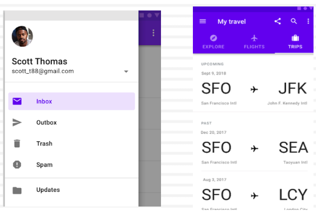

# Week 6 - Android Navigation

## Outline

- Navigation in Material Design
- Navigation Drawer
- Jetpack Navigation Components
  - NavigationUI
  - NavHost
  - NavController
  - Navigation Graph

## Material Design - Navigation

- Material is a design system created by Google
- Three types of navigation suggested in Material Design

  1. Lateral navigation
  2. Forward navigation
  3. Reverse navigation

***

- 页面跳转控件

- 在 create new project 时候会提供自动生成的 含有 navigation view的activity

  - Bottom Naviagation Activity

  - Navigation Drawer Activity

  - 通常作为 mainActivity 使用

- Navigation 不是唯一的页面跳转的控件

### Lateral Navigation

Lateral Navigation occurs between screens at the same level of hierarchy

- **Navigation Drawer**, Tabs, or Bottom Navigation

### Forward Navigation

- **Downward** from a parent screen to a child screen
- **Sequentially** through a flow
- **Directly** from one screen to any other in the app  Implemented using:
  - Cards or lists
  - Buttons that lead to another screen
  - In-app search on one or more screens
  - Links within the content

### Reverse Navigation

Reverse chronological navigation

- Navigating in reverse order
- Back Button in the Android navigation bar
- Back Button in a web browser

Upward navigation

- Navigate one level upwards within a hierarchy
- An Up action

## Navigation Drawer

**Standard navigation** drawers allow interaction with both screen contents and the drawer at the same time

- **Permanently visible drawer**: has a fixed position on the screen
  - They are suitable for tablets and desktop computers
- **Dismissible drawer**: can be opened and closed (with **an inlay style**)

### Navigation Drawer Types: Modal and Bottom Drawers

- **Modal drawers** overlay the content and block interaction, suitable for mobile phones with limited screen sizes
- **Bottom drawer** is a type of modal drawer that opens from the bottom of the screen rather than the side

### Android Navigation Drawer

- The navigation drawer is a UI panel that allows navigation between top level destinations through displaying a navigation menu
- The navigation drawer appears when the user touches the drawer icon in the app bar
- **NavigationView*** and the Android **Navigation component** are used to create a navigation drawer
- There are certain key components of a navigation drawer such as the header, menu, and app bar as the XML files that we need to create