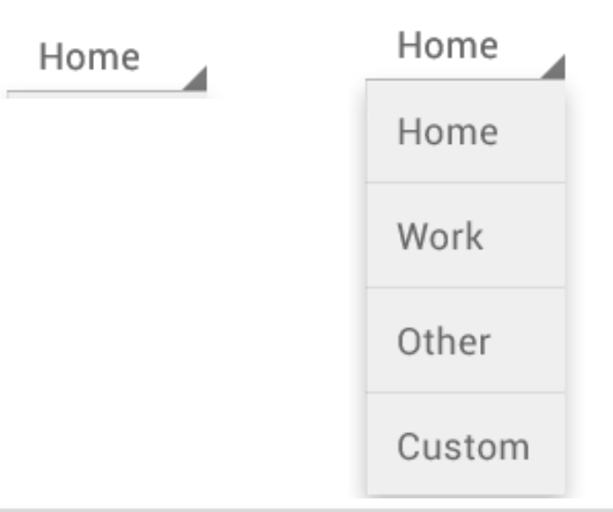

# Week 2 - Android Spinner

## Spinner

- A spinner provides an easy way to display a set of values that the user can select from
- A spinner shows its selected (or default) item
- When the spinner is touched, it displays a dropdown menu with all the other options
- Populating spinners dynamically requires using a SpinnerAdapter such as an ArrayAdapter

## Spinner and ArrayAdapter

1. First need to declare a list to hold your items to display

        List<String> list = new ArrayList<String>();
        list.add("Toy Story");
        list.add("Up");
        list.add("Shrek");

2. Instantiate an ArrayAdapter<T> by passing to its constructor the current context, a spinner layout and a list of objects: ArrayAdapter (Context context, int resource, T[ ] objects)

        ArrayAdapter<String> spinnerArrayAdapter = 
        new ArrayAdapter<String>(this, android.R.layout.simple_spinner_item, list);

3. Then the adapter can be applied to the spinner
`binding.movieSpinner.setAdapter(spinnerAdapter);`

## Adding Items to Spinner

- You can add new items to the spinner by adding them first to the adapter

- Call the adapter’s add( ) method
    – `spinnerAdapter.add(newItem);`
    – It adds the new object at the end of the array

- Notify the adapter of the change so it refreshes itself
    – `spinnerAdapter.notifyDataSetChanged();`

## Selecting Items from Spinner

Register with the listener, implement the onItemSelected() method, and also include the onNothingSelected( ) method

    binding.movieSpinner.setOnItemSelectedListener 
    (new AdapterView.OnItemSelectedListener() {

    //parent is the AdapterView where the click happened
    //view is the view within the AdapterView that was clicked 
    //Spinner, ListView or GridView are subclasses of AdapterView <?> 
    //position is the position of the view in the adapter
    //id is the row id of the item that was clicked

        @Override
        public void onItemSelected(AdapterView<?> parent, View view, int position, long id) 
        { 
            String selectedMovie = parent.getItemAtPosition(position).toString(); 
            if(selectedMovie != null){
                Toast.makeText(parent.getContext(),"Movie selected is " +
                selectedMovie,Toast.LENGTH_LONG) .show();
            } 
        }
        @Override
        public void onNothingSelected(AdapterView<?> parent) {
        } 
    });

Toast methods:

1) public static Toast makeText (Context context, CharSequence text, int duration) 
1) public void show ()

## Spinner: MainActivity.java

    public class MainActivity extends AppCompatActivity {

    private ActivityMainBinding binding;

    @Override
    protected void onCreate(Bundle savedInstanceState) {
        super.onCreate(savedInstanceState);
        binding = ActivityMainBinding.inflate(getLayoutInflater());
                                                #activity_main.xml里的LinearLayout
        View view = binding.getRoot();
        setContentView(view);
        #把view加载到当前的activity里面

        List<String> list = new ArrayList<String>();
        list.add("Toy Story");
        list.add("Up");
        list.add("Shrek");

        final ArrayAdapter<String> spinnerAdapter = new ArrayAdapter<String>(this, android.R.layout.simple_spinner_item, list);
        binding.movieSpinner.setAdapter(spinnerAdapter);

        binding.addButton.setOnClickListener(new View.OnClickListener() {
            public void onClick(View v) {
                String newMovie=binding.editText.getText().toString(); //捕获用户的输入
                spinnerAdapter.add(newMovie);       //加入到arraylist中
                spinnerAdapter.notifyDataSetChanged(); //内容改变了就刷新，不需要通过重启app来刷新数据
                binding.movieSpinner.setSelection(spinnerAdapter.getPosition(newMovie));
                                    //强制更改选项内容，setSelection只能接受int值
            }
        });

        binding.clearButton.setOnClickListener(new View.OnClickListener() {
            @Override
            public void onClick(View v) {
                binding.editText.setText("");
            }
        });
    }
    }
