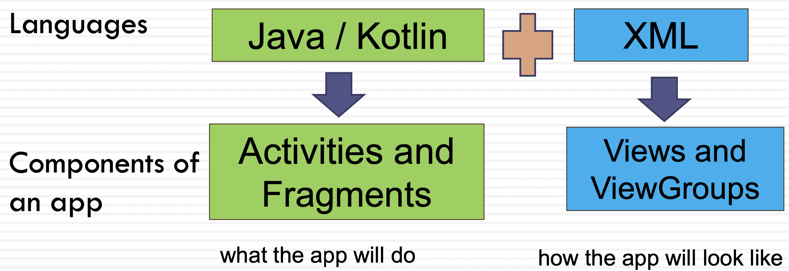
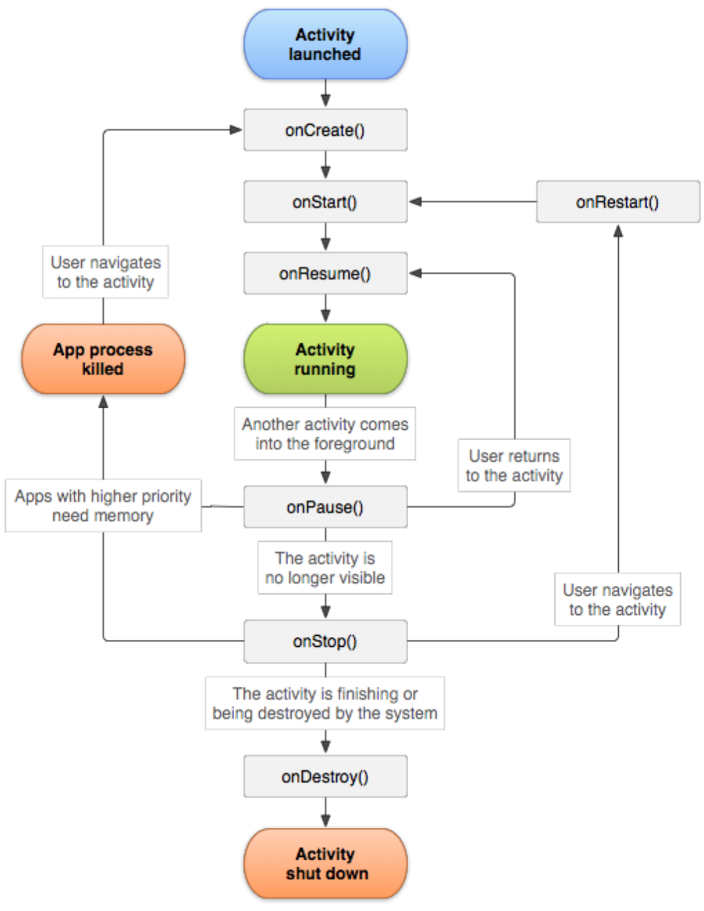

# Week 2 - Intro Android

## Outline

- Mobile Applications
- Android History
- Androidx
- Android Studio
- Layouts
- Android Files
- AVD (Android Virtual Devices)

## Mobile Applications

1. Native apps
2. Web apps
3. Progressive Web Apps (PWAs)

### Native App

- Written in a native language like Android or Swift, so compiled into the machine code
- Distributed through native app stores (Apple App Store or Google Play) and requires installation on the device
- For updates, the user need to download the new version
- Specific to a certain mobile platform and not cross-platform
- Requires learning the native language
- High performance
- Provides full access to all the features and hardware of the device
- Offline operation capability
- Built-in security layers

### Web Apps

- Web Apps are usually built with HTML5, CSS and JavaScript
- No need to download and install the app
- Run in the web browser of the device like a web page
- Cross-platform
- Easier to modify and update web apps (automatic updates)
- The lack of access to hardware features (e.g. sensors or camera)
- Low performance (in terms of speed and responsiveness)
- **Hybrid apps**: combining the native apps and web apps
  - Flutter, React Native and Ionic

### Progressive Web App (PWA)

- Built using web technologies like HTML5 and JavaScript
- Run in a standalone window instead of a browser tab
- Supported by modern browsers
- Fast and simple installation (publishing on mobile app stores optional)
- Automatic updates
- Native-like capabilities and access to the device hardware level information, and features like file system access and push notifications
- Offline operation capability
- Good performance
- Progressive Web Apps must meet the criteria of being installable <https://web.dev/pwa-checklist/>

## Android history

Probably not on the exam

## Android Jetpack

- Jetpack includes a large group of libraries for developing high quality apps
- androidx.* contains the Android Jetpack libraries
  - The previous support library packages have been mapped into corresponding androidx.* packages
  - AndroidX provides backward compatibility across Android releases
- The libraries are created based on best practices (less crashes and memory leaks)
- They provide consistency across Android versions and devices
- They reduce boilerplate code and complexities

<https://developer.android.com/jetpack>

## Layouts - part of Android Jetpack

- A layout defines a structure for an UI in the activities/fragments
- A layout’s elements consist of a hierarchy of View and ViewGroup objects
- A **ViewGroup** is like an invisible container that can contain other views
- A **ViewGroup** is the base class for layouts (views’ containers)
- The ViewGroup objects are known as layouts e.g. a LinearLayout
- A **View** is the basic class for widgets (UI components)
  - The View objects are known as widgets e.g. a Button or a TextField

### Common Layouts

- ConstraintLayout
- RelativeLayout
- Linear layouts (Vertical or Horizontal)
- FrameLayout
- GridLayout

### ConstraintLayout

- ConstraintLayout is the default layout in Android Studio
- It supports creating complex layouts
- It can be built entirely by using the Layout Editor's visual tools (not the xml code)
- Similar to the relative layout, it creates a flat view hierarchy (not suitable for the nested view groups)
- It requires adding constraints to define the positon of a view
  - At least one horizontal and one vertical constraint for the view
- For more information refer to: <https://developer.android.com/training/constraint-layout>

### Layouts with an Adapter

- Layouts that their contents are dynamic
- Layouts that use an **adapter** to pull the content from a source such as an array or a database, and enter them into the list

1. RecyclerView (recommended)

- A flexible view to display a list of large data set
- Efficient, better performance

2. ListView

## Android Directories and Files

- manifests
  - manifests/**AndroidManifest.xml**
- Gradle Scripts
  - **build.gradle** (Project: APPLICATION_NAME)
  - **build.gradle** (Module: app)
  - **settings.gradle**
- java
  - java/PACKAGE_NAME/ **MainActivity.java**
- res
  - res/drawable
  - res/layout/**activity_main.xml** (and any other layout files)
  - res/menu - menu layout files
  - res/values/**strings.xml**

### AndroidManifest.xml

- All Android applications have an AndroidManifest.xml file under /manifests
- It includes the important information about the app
  - Description of the components of the application such as the activities (when you have more than one activity or using services)
  
        <activity android:name=".MainActivity"
            android:exported="true"> 
            <intent-filter>
                <action android:name="android.intent.action.MAIN" />
                <category android:name="android.intent.category.LAUNCHER" /> 
            </intent-filter>
        </activity>
        <activity android:name=".SecondActivity"> 
        </activity>

 As of Android 12, `android:exported` must be set; use **true** to make the activity **available** to other apps, and false otherwise. For launcher activities, this should be set to true.

- For declaring the required permissions like the access to the internet:

        <uses-permission android:name="android.permission.INTERNET"/>

### An Example of AndroidManifest.xml

        <?xml version="1.0" encoding="utf-8"?>
        <manifest xmlns:android="http://schemas.android.com/apk/res/android"
            package="com.example.helloworld>

        <application
            android:allowBackup="true" 
            android:icon="@mipmap/ic_launcher" 
            android:label="@string/app_name" 
            android:roundIcon="@mipmap/ic_launcher_round" 
            android:supportsRtl="true" 
            android:theme="@style/Theme.HelloWorld">

        <activity 
            android:name=".MainActivity" 
            android:exported="true"> 
            <intent-filter>
                <action android:name="android.intent.action.MAIN" />
                <category android:name="android.intent.category.LAUNCHER" /> 
            </intent-filter>
        </activity> 
        
        </application>

### build.gradle Files

- Android build gradle provides a custom build tool to manage and configure building android apk files
- It facilitates importing, downloading and adding local and remote dependencies
- Important build gradle files:
  - build.gradle (Project: APPLICATION_NAME)
    - settings.gradle
  - build.gradle (Module: app)
- The scope of gradle Project is for the whole project
- The scope of gradle Module is just for that module

#### build.gradle (Project) and settings.gradle

Gradle files enable you to easily import and use remote repositories

- A repository refers to location where all the libraries and jar files are stored
- Repositories include google() and mavenCentral repositories
  - jcenter() is no longer used
- The additional repositories previously added in the project level build.gradle file (under the “allprojects” must be now added in the settings.gradle file
  - An example: adding additional repositories by third parties

#### build.gradle (Module:app)

- Gradle Module includes information about compileSdk, minSdk, targetSdk, versionCode and name
- You can add and configure application dependencies here but make sure their repository are included in the settings.gradle

### res/values/strings.xml

- You can include String constants in this file
- It allows managing all UI text in a single location
- It is easier to find and update text in an app
- In the Java code, reference it as
`String message = getString(R.string.edit_message)`

Example:

    <EditText 
        android:id="@+id/edit_message"
        android:layout_width="wrap_content" 
        android:layout_height="wrap_content" 
        android:hint="@string/edit_message" />
        ...
activity_main.xml

    <resources>
    <string name="app_name">My Application</string>
    <string name="edit_message">Enter a word</string> </resources>
strings.xml

### activity_main.xml

- Under the app->res->layout
- activity_main.xml controls the entire project’s UI
- View modes: Design, Code, Split
- Design Editor: allows dragging UI elements into a visual design editor
- Text Editor: allows you to use the XML code to control the GUI elements
- Default layout: ConstraintLayout

### MainActivity.java

- MainActivity.java defines how the application will behave and interact with the user
- When you build and run your application, in the MainActivity class, the **setContentView()** method loads and inflates the XML layout file that passed to it as an argument and create a view hierarchy tree

`setContentView(R.layout.activity_main);`

    package com.example.pdelir.myapplication;

    import androidx.appcompat.app.AppCompatActivity;
    import android.os.Bundle;

    public class MainActivity extends AppCompatActivity { It is the base class for activities and uses a Toolbar as an app bar.
        @Override
        protected void onCreate(Bundle savedInstanceState) { A bundle is passed to the method that contains the activity's previously frozen state, 
                                                            if there was one.
            super.onCreate(savedInstanceState);
            setContentView(R.layout.activity_main);
            
        }
    }
**setContentView()** sets the activity content from a layout resource that will be inflated, adding all top-level views to the activity. It will load activity_main.xml

### Views and Ids

- By default each view has an android:id

        <EditText 
            android:id="@+id/editText" 
            android:layout_width="wrap_content" 
            android:layout_height="wrap_content"/>

- These ids after Save (compile) will automatically appear in R.java and you can reference them by their name
- Without an id, you cannot reference a view in an activity or a fragment
- E.g. in the MainActivity.java class in the onCreate() method you write:
  
        EditText editText = findViewById(R.id.editText); 
        editText.setText(“Hello”);

- Instead of using findViewById for each view, You can use **View binding** that is part of Android Jetpack (it will be discussed later)
  - `binding.editText.setText(“Hello");`

https://developer.android.com/topic/libraries/view-binding

## Activity Lifecycle

An activity goes through a number of states during its lifetime

**onCreate( )**

- Initialize the activity components e.g. creating views, or populating lists with data
- The setContentView() method must be called here

**OnStart( )**

- the activity becomes visible

**onResume( )**

- The activity is ready to accept the user input
- At the top of the activity stack (in the foreground)

**onPause( )**

- The activity loses focus, and will enter the stopped or resumed state

**onStop( )**

- The activity is no longer visible

**onDestroy( )**

- The activity is about to be terminated

## Kotlin Language

- “Statically typed programming language for modern multiplatform applications” (kotlinlang.org)
- Kotlin key features:
  - It is concise
  - It is safe (**avoiding the NullPointerException problem**)
  - It is tool friendly
- Works with Java Virtual machine
- It is fully interoperable with JavaTM and AndroidTM
  - You can convert your Java code to Kotlin

