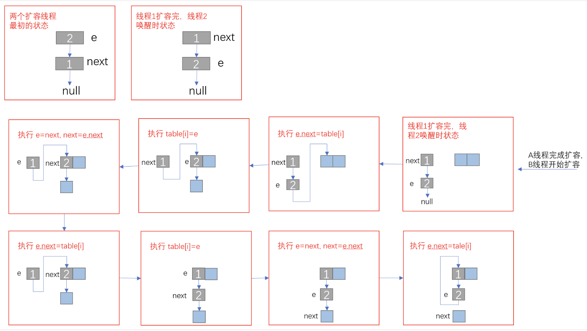
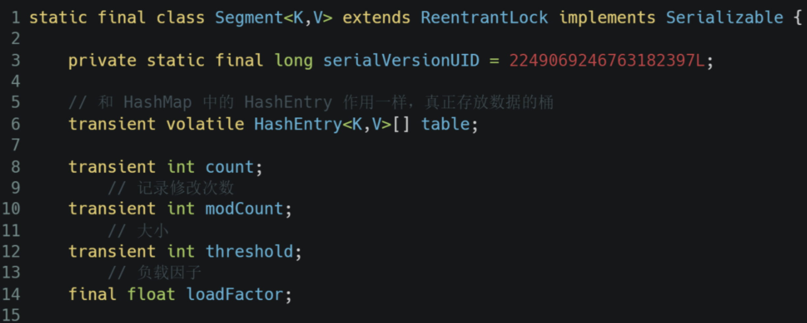
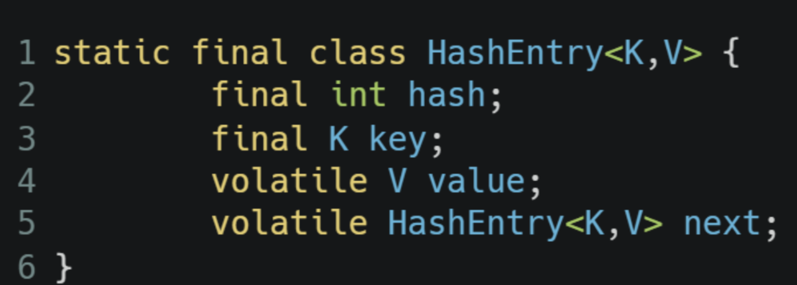
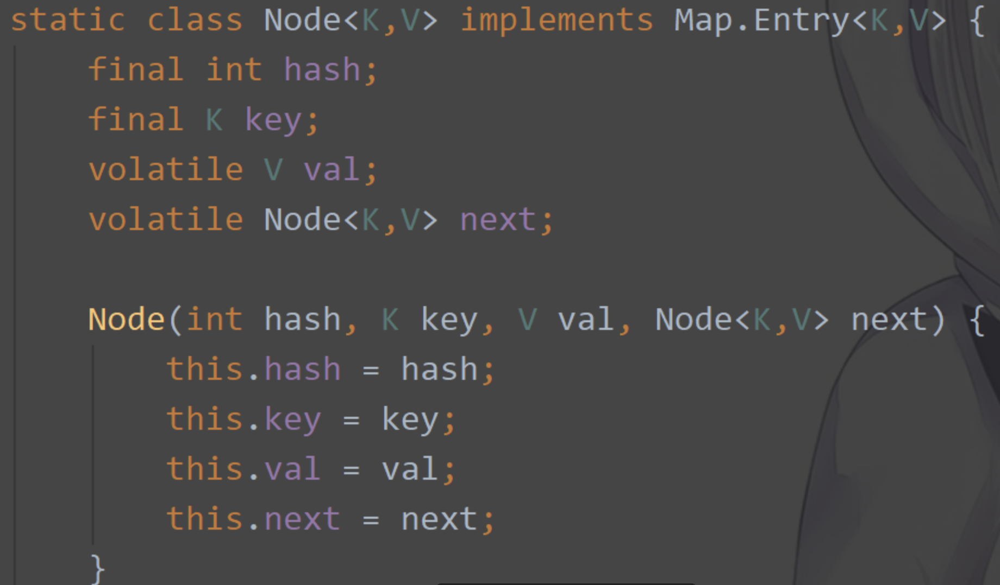
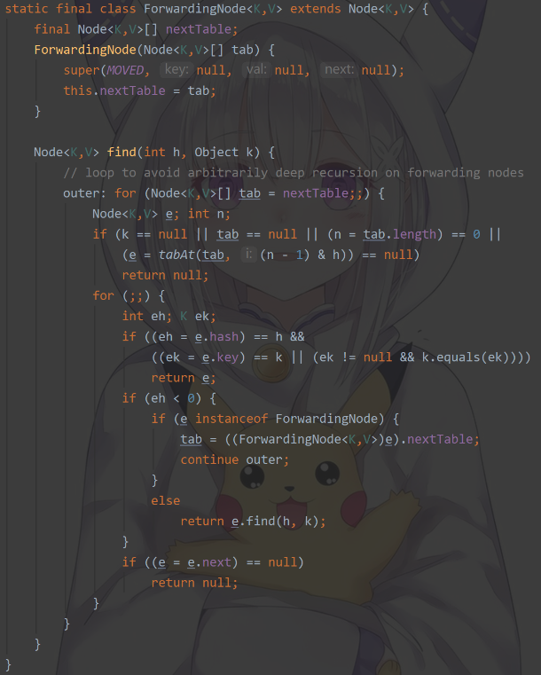

# Java集合

## List，Set，Map区别

**List：** 存储的元素有序，可重复

**Set：** 存储的元素无序，不可重复

**Map：** 使用键值对存储，Key无序且不可重复，Value无序可重复，每个键最多映射到一个值

## ArrayList和LinkedList区别

### 线程安全

两者都是非线程安全

### 底层数据结构

ArrayList使用Object数组；LinkedList使用双向链表（JDK1.6之前为循环链表，JDK1.7取消了循环）

### 是否支持快速随机访问

ArrayList支持（起始地址+偏移量*元素大小），LinkedList不支持

### 内存占用

ArrayList空间浪费主要体现在list列表结尾会预留一定的容量空间，而LinkedList空间浪费主要在每个元素都需要存一个前驱和后继指针

### 插入和删除是否受元素位置的影响

ArrayList影响主要在于插入前和删除后元素的移动，LinkedList影响主要在于遍历链表找到元素所在的位置

## ArrayList和Vector区别？为什么要用ArrayList取代Vector

- ArrayList底层使用Object数组存储，非线程安全；Vector底层也用Object数组，线程安全；Vector里的方法基本都加了synchronized锁，效率没有ArrayList高
- ArrayList大多数情况下扩容为原来的1.5倍；Vector扩容为原来的两倍；所以ArrayList有利于节省空间

## ArrayList扩容机制

### ArrayList属性

    transient Object[] elementData; //元素数组
    private int size; //元素包含数量

### ArrayList的三种构造方法

#### ArrayList(int initialCapacity)

根据传入的初始化容量，创建ArrayList数组。如果在使用时预先知道数组的大小，一定要使用该构造方法，可以避免数组扩容提升性能，同时也是合理使用内存

    private static final Object[] EMPTY_ELEMENTDATA = {};

    public ArrayList(int initialCapacity){
        //初始化容量大于0时，创建Object数组
        if (initialCapacity > 0){
            this.elementData = new Object[initialCapacity];
        // 初始化容量等于0时，使用EMPTY_ELEMENTDATA对象
        }else if (initialCapacity == 0){
            this.elementData = EMPTY_ELEMENTDATA;
        //初始化容量小于0时，抛出IllegalArguementException
        }else{
            throw new IllegalArguementException("Illegal Capacity: " + initialCapacity)
        }
    }

#### ArrayList(Collection<? extends E> c)

使用传入的c集合，作为ArrayList的elementData

    public ArrayList(Collection<? extends E> c){
        //将c转换成Object数组
        elementData = c.toArray();
        //如果数组大小大于0
        if((size = elementData.length) != 0){
            // defend against c.toArray(incorrectly) not return Object[]
            (see e.g. https://bugs.openjdk.java.net/browse/JDK-6260652)
            // <x> 如果集合元素不是Object[]类型，则会创建新的Object[]数组，并将elementData赋值到其中
            if (elementData.getClass() != Object[].class);
            //如果数组大小等于0，则使用EMPTY_ELEMENTDATA
        } else {
            //replace with empty array
            this.elementData = EMPTY_ELEMENTDATA
        }
    }

#### ArrayList()

无参构造方法，使用的最多的构造方法

    //Default initial capacity
    private static final int DEFAULT_CAPACITY = 10;

    /*
     * 共享的空数组对象，用于{@link #ArrayList()}构造方法
     * 
     * 通过使用该静态变量，和{@link #EMPTY_ELEMENTDATA} 区分开来，在第一次添加元素时
     * 
     * Shared empry array instance used for default sized empty instance. 
     * We distinguish this from EMPTY_ELEMENTDATA to know how much to inflate when element is added.
     * /

    private static final Object[] DEFAULTCAPACITY_EMPTY_ELEMENTDATA = {};

    //Constructs an empty list with an initial capacity of ten

    public ArrayList(){
        this.elementData = DEFAULTCAPACITY_EMPTY_ELEMENTDATA;
    } 

为什么单独声明了DEFAULTCAPACITY_EMPTY_ELEMENTDATA空数组，而不直接使用EMPTY_ELEMENTDATA呢？因为DEFAULTCAPACITY_EMPTY_ELEMENTDATA首次扩容为10，而EMPTY_ELEMENTDATA按照1.5倍扩容从0开始而不是10

### 扩容

整个的扩容过程，首先创建一个新的更大的数组，一般是 1.5 倍大小，然后将原数组复制到新数组中，最后返回新数组

    private Object[] grow(){
        // <1>
        return grow(size + 1);
    }

    private Object[] grow(int minCapacity) {
        int oldCapacity = elementData.length;
        //<2> 如果原容量大于0，或者数组不是DEFAULT_EMPTY_ELEMENTDATA时，计算新的数组大小
        if (oldCapacity > 0 || elementData != DEFAULTCAPACITY_EMPTY_ELEMENTDATA){
            int newCapacity = ArraySupport.newLength(oldCapacitry, minCapacity - oldCapacity, oldCapacity >> 1);
            return elementData = Arrays.copyOf(elementData, newCapacity);
            //<3> 如果是DEFAULTCAPACITY_EMPTY_ELEMENTDATA数组，直接创建新的数组即可
        } else {
            return elementData = new Object[Math.max(DEFAULT_CAPACITY, minCapacity)];
        }
    }

minCapacity指满足本次扩容的最小容量；
<2>处，说明如果数组中有元素或者不是利用无参构造方法创建的，那么计算新的数组的大小，计算方法简单的可以理解为max(minCapacity - oldCapacity, oldCapacity >> 1) + oldCapacity，即前者指最小满足本次扩容的容量减去原来的容量，就是最小需要扩容容量；后者指原来的容量除以2；
对于max操作来说，一般都是后者更大，有两种情况除外：
1.oldCapacity为0，那么除以2还是为0，而minCapacity最小为1（因为只有添加元素时才会触发扩容）；
2.批量添加元素时（addAll），此时minCapacity需要的最小扩容容量可能会比原来容量的一半要大；
<3>则说明是无参构造方法创建的，取默认容量（10）和最小满足要求容量的最大值。所以一般用无参方法构建的数组默认容量为0，是空数组，只有在添加元素时，容量才有可能为10.

### 缩容

    public void trimToSize() {
        //增加修改次数
        modCount++;
        //如果有多余的空间，则进行缩容
        if (size < elementData.length) {
            elementData = (size == 0)
                ? EMPTY_ELEMENTDATA //大小为0时，直接使用EMPTY_ELEMENTDADA
                : Arrays.copyOf(elementData, size);
        }
    }

## 多线程场景下如何使用ArrayList

1. 通过Collections的synchronizedList方法将其转换成线程安全的容器后再使用

        List<String> synchronizedList = Collections.synchronizedList(list);
        synchronizedList.add("aaa");
        synchronizedList.add("bbb");
        for (int i = 0; i < synchronizedList.size(); i++) {
            System.out.println(synchronizedList.get(i));
        }

2. 使用CopyOnWriteArrayList

## HashMap和HashTable区别

### 线程安全

HashMap非线程安全，HashTable线程安全

### 效率

HashTable因为线程安全，有额外的同步操作，HashMap的效率更高

### 初始容量和扩容策略

- HashMap默认初始化小大为16，若给定大小，则会将其扩充为2的幂次方大小；每次扩容为原来的2倍
- HashTable默认初始化大小为11，若给定大小，则直接使用给定的大小；每次扩容变为原来的2n + 1

### 对Null key和Null value支持

- HashMap支持Null作为键和值
- HashTable不允许有null键和值，否则会抛出NullPointerException

原因

- Hashtable使用Enumeration迭代器是安全失败机制（fail-safe），在使用过程中允许别的线程修改数据，如果存了null会存在二义性
- 而HashMap是fail-fast机制，遍历过程中不允许修改，不然报异常Concurrent Modification Exception；Hashtable使用Iterator迭代器是fail-fast机制

### 哈希地址

hashtable没有加扰动函数直接用key的hashcode，hashmap加了扰动函数

### 底层数据结构

JDK1.8 以后的 HashMap 在解决哈希冲突时有了较大的变化，当链表长度大于阈值（默认为 8）（将链表转换成红黑树前会判断，如果当前数组的长度小于 64，那么会选择先进行数组扩容，而不是转换为红黑树）时，将链表转化为红黑树，以减少搜索时间。Hashtable 没有这样的机制，一直都是数组+链表的形式

## HashMap和HashSet区别

HashSet底层就是基于HashMap实现的，HashSet的源码非常非常少，因为除了clone() 、 writeObject() 、 readObject() 是 HashSet自己不得不实现之外，其他方法都是直接调用 HashMap 中的方法

| HashMap | HashSet |
| --- | --- |
| 实现了Map接口 | 实现了Set接口 |
| 存储键值对 | 仅存储对象 |
| 调用put()向map中添加元素 | 调用add()方法添加元素 |
| HashMap**使用键（Key）** 计算hashcode | HashSet**使用成员对象** 来计算hashcode值，对于两个对象来说hashcode可能相同，所以equals()方法用来判断对象的相等性 |

## HashSet实现原理

HashSet 是基于 HashMap 实现的，HashSet的值存放于HashMap的key上，HashMap的value统一为
PRESENT(new Object())，因此 HashSet 的实现比较简单，相关 HashSet 的操作，基本上都是直接调用底层
HashMap 的相关方法来完成，HashSet 不允许重复的值

## HashSet如何检查重复

当你把对象加入 HashSet 时， HashSet 会先计算对象的 hashcode 值来判断对象加入的位置，同时也会与其他加入的对象的 hashcode 值作比较，如果没有相符的 hashcode ， HashSet 会假设对象没有重复出现。但是如果发现有相同 hashcode 值的对象，这时会调用 equals() 方法来检查hashcode 相等的对象是否真的相同。如果两者相同， HashSet 就不会让加入操作成功

## HashMap底层实现

### JDK1.8之前

JDK1.8之前HashMap底层是数组和链表结合在一起使用也就是链表散列。HashMap通过key的hashCode经过扰动函数处理过后得到hash值，然后通过(n - 1) & hash判断当前元素存放的位置（这里的 n 指的是数组的长度），如果当前位置存在元素的话，就判断该元素与要存入的元素的hash值以及key是否相同，如果相同的话，直接覆盖，不相同就通过拉链法解决冲突

所谓扰动函数指的就是 HashMap 的 hash 方法。使用 hash 方法也就是扰动函数是为了防止一些实现比较差的 hashCode() 方法，换句话说使用扰动函数之后可以减少碰撞

JDK1.8的hash方法相比于JDK1.7的hash方法更加简化，但是原理不变

    static final int hash(Object key) {
        int h;
        // key.hashCode(): 返回散列值也就是hashcode
        // ^: 按位异或
        // >>>: 无符号右移
        return (key == null) ? 0 : (h = key.hashcode()) ^ (h >>> 16)
    }

对比一下JDK1.7的HashMap的hash方法源码

    static int hash(int h){
        //This function ensures that hashCodes that differ only by constant multiplesat each bit pisition
        //have a bounded number of collisions(approximately 8 at default load factor)

        h ^= (h >>> 20) ^ (h >>> 12);
        return h ^ (h >>> 7) ^ (h >>> 4);
    }

### JDK1.8之后 :heart: :heart: :heart:

---
相比于之前的版本， JDK1.8 之后在解决哈希冲突时有了较大的变化，当链表长度大于阈值（默认为 8）（将链表转换成红黑树前会判断，如果当前数组的长度小于 64，那么会选择先进行数组扩容，而不是转换为红黑树）时，将链表转化为红黑树，以减少搜索时间

**解决哈希冲突的方法有哪些？HashMap用的哪种**  
解决Hash冲突方法有:开放定址法、再哈希法、链地址法（拉链法）、建立公共溢出区。HashMap
中采用的是 链地址法

**为什么在解决 hash 冲突的时候，不直接用红黑树？而选择先用链表，再转红黑树**  
因为红黑树需要进行左旋，右旋，变色这些操作来保持平衡，而单链表不需要。当元素小于 8 个的时候，此时做查询操作，链表结构已经能保证查询性能。当元素大于 8 个的时候， 红黑树搜索时间复杂度是 O(logn)，而链表是 O(n)，此时需要红黑树来加快查询速度，但是新增节点的效率变慢了。当链表长度到达 8 的概率是 0.00000006，但还是有这种情况，所以我们转换为红黑树效率会来得高

**为什么不使用平衡树而使用红黑树**  
虽然平衡树解决了二叉查找树退化为近似链表的缺点，能够把查找时间控制在 O(logn)，不过却不是最佳的，因为平衡树要求每个节点的左子树和右子树的高度差至多等于1，这个要求实在是太严了，导致每次进行插入/删除节点的时候，几乎都会破坏平衡树的第二个规则，进而我们都需要通过左旋和右旋来进行调整，使之再次成为一颗符合要求的平衡树。显然，如果在那种插入、删除很频繁的场景中，平衡树需要频繁着进行调整，这会使平衡树的性能大打折扣，为了解决这个问题，于是有了红黑树

**红黑树特点**

1. 具有二叉查找树的特点  
2. 根节点是黑色的  
3. 每个叶子节点都是黑色的空节点，也就是说，叶子节点不存数据  
4. 任何相邻的节点都不能同时为红色，也就是说，红色节点是被黑色节点隔开的  
5. 每个节点，从该节点到达其可达的叶子节点的所有路径，都包含相同数目的黑色节点

**HashMap存值的总体过程** :blue_heart: :purple_heart: :heart:

1. 在put的时候判断数组是否存在，如果不存在则用 resize 方法创建默认长度为16的数组  
2. 根据key计算hash值，确定在数组中的位置  
3. 判断该位置是否有元素，如果没有直接创建一个 Node 存入  
4. 如果有元素，通过equals方法判断 key 是否相同，如果相同则覆盖，并且将原来的值直接返回  
5. 如果 key 不相同，在原 Node 基础上添加新的 Node，判断该位置是链表还是红黑树  
    5.1 若为红黑树，则将结点存入树中  
    5.2 若为链表，遍历链表；链表中存在则复用，没有则新建结点加入；判断是否需要转为红黑树  
6. 判断是否需要数组扩容

**HashMap扩容（resize（））** :blue_heart: :purple_heart: :heart:

两倍扩容 HashMap，实际上，在构造方法中，table 数组并未初始化，它是在 resize() 方法中进行初始化，所以这是该方法的另外一个作用：初始化数组

:star2:**过程**:star2:

step1: 计算新的容量和阈值，并创建新的数组

1. 果容量大于最大容量2^30，则不允许扩容；Int最大值为2^31 - 1，所以最大容量为2^30
2. 如果旧的容量大于0，说明非空表，进行两倍扩容，newCap=oldCap << 1, newThr=oldThr << 1(阈值和容量都扩大一倍)
3. 否则如果阈值不为0，说明创建时传入了容量大小（非无参构造），那么newCap=oldThr
4. 否则如果1、2都不符合，则说明是初始化操作，newCap = DEFAULT_INITIAL_CAPACITY, newThr = (int)(DEFAULT_LOAD_FACTOR * DEFAULT_INITIAL_CAPACITY);默认容量为16，默认负载因子为0.75
5. 如果上述操作没有计算出newThr,则newThr=newCap * loadFactor

step2: 将老的table复制到新的table中

1. 如果旧数组不为空，遍历旧数组
2. 如果数组中当前结点不为空
3. 将该结点复制给局部变量，且将旧数组此位置置NULL
4. 如果该结点没有next==null，则直接复制到新数组，下标计算方式为：hash&（newCap-1）
5. 如果next != null  
   5.1 如果是红黑树结点，则通过红黑树分裂处理  
   5.2 如果是链表，则遍历链表中的元素，分配到新数组中。链表中的元素有且只会被分配到新数组的两个位置（1.原下标；2.原下标 + 旧数组的长度）；hash & oldCap == 0 ? 位置1 ： 位置2

**为什么HashMap中的数组容量要为2的幂次方**

这与计算散列到数组中的哪个位置的计算方式有关。按照正常逻辑，计算散列到数组的哪个下标应该为hash % (len - 1)；而当len为2的幂次方时，可以用&操作来等效替代，即hash & (len - 1)，&在计算机中速度比%快。

**HashMap缩容**

暂时未提供缩容操作，想要了解参照Redis中hash的缩容

---

### HashMap默认加载因子是多少？为什么是0.75，不是0.6或者0.8

默认的loadFactor是0.75，0.75是对空间和时间效率的一个平衡选择，一般不要修改，除非在时间和空间比较特殊的情况下 ：1.如果内存空间很多而又对时间效率要求很高，可以降低负载因子Load factor的值；2.如果内存空间紧张而对时间效率要求不高，可以增加负载因子loadFactor的值，这个值可以大于1

## Java8中相对于Java7，对HashMap做了哪些优化

1. JDK 8 为红黑树 + 链表 + 数组的形式，当桶内元素大于8时，便会树化
2. hash 值的计算方式不同，少了扰动次数(jdk 8 简化)
3. 1.7 table在创建hashmap时分配空间，而1.8在put的时候分配，如果table为空，则为table分配空间
4. 在发生冲突，插入链中时，7是头插法，8是尾插法
5. 在resize操作中，7需要重新进行index的计算，而8不需要，通过判断相应的位是0还是1，要么依旧是原index，要么是oldCap + 原index

## 一般用什么作为HashMap的key

一般用Integer、String 这种不可变类当 HashMap 当 key，而且 String 最为常用

- 因为字符串是不可变的，所以在它创建的时候 hashcode 就被缓存了，不需要重新计算。这就是 HashMap 中的键往往都使用字符串的原因
- 因为获取对象的时候要用到 equals() 和 hashCode() 方法，那么键对象正确的重写这两个方法是非常重要的,这些类已经很规范的重写了 hashCode() 以及 equals() 方法

## HashMap为什么线程不安全？

1. 多线程下扩容死循环。JDK1.7中的 HashMap 使用头插法插入元素，在多线程的环境下，扩容的时候有可能导致环形链表的出现，形成死循环。因此，JDK1.8使用尾插法插入元素，在扩容时会保持链表元素原本的顺序，不会出现环形链表的问题
2. 多线程的put可能导致元素的丢失。多线程同时执行 put 操作，如果计算出来的索引位置是相同的，那会造成前一个 key 被后一个 key 覆盖，从而导致元素的丢失。此问题在JDK 1.7和JDK 1.8 中都存在
3. put和get并发时，可能导致get为null。线程1执行put时，因为元素个数超出threshold而导致rehash，线程2此时执行get，有可能导致这个问题。此问题在JDK 1.7和 JDK 1.8 中都存在

ref: https://mp.weixin.qq.com/s?__biz=MzkyMTI3Mjc2MQ==&mid=2247485906&idx=1&sn=64785914b2bc6c53b21d7c62fbb605a7&source=41#wechat_redirect

## HashMap多线程操作导致死循环问题

jdk1.7 产生环的原因是当线程A扩容好后，实际1和2的结点顺序和在线程B中保存的顺序不一致产生的

## HashMap，LinkedHashMap，TreeMap 区别

LinkedHashMap 保存了记录的插入顺序，在用 Iterator 遍历时，先取到的记录肯定是先插入的；
TreeMap 实现 SortMap 接口，能够把它保存的记录根据键排序（默认按键值升序排序，也可以指定排序的比较器）

- HashMap：在 Map 中插入、删除和定位元素时
- TreeMap：在需要按自然顺序或自定义顺序遍历键的情况下
- LinkedHashMap：在需要输出的顺序和输入的顺序相同的情况下

## ConcurrentHashMap和HashMap的区别

- ConcurrentHashMap是线程安全的，HashMap是非线程安全的

- ConcurrentHashMap和HashTable一样key和value都不能存null  
  - 原因：在多线程下存null值会存在二义性，单线程下不会有二义性；例如，用hashmap的get方法返回了一个null，我们不知道它是value值为null还是没有这个key，但我们可以通过containsKey来消除二义性；而concurrentHashMap则不行，如，真实情况为不存在这个key，线程A调用了get方法，之后调用containskey方法，而在这两者之间有个线程B执行了put(key, null)，那么就存在了二义性；

## ConcurrentHashMap 和 Hashtable 的区别

### 底层数据结构

JDK1.7 的 ConcurrentHashMap 底层采用 分段的数组+链表 实现，JDK1.8采用的数据结构跟 HashMap1.8 的结构一样，数组+链表/红黑二叉树。 Hashtable 和JDK1.8 之前的 HashMap 的底层数据结构类似都是采用 数组+链表 的形式，数组是 HashMap的主体，链表则是主要为了解决哈希冲突而存在的

### 实现线程安全的方式

1. 在 JDK1.7 的时候， ConcurrentHashMap （分段锁） 对整个桶数组进行了分割分段( Segment )，每一把锁只锁容器其中一部分数据，多线程访问容器里不同数据段的数据，就不会存在锁竞争，提高并发访问率。 到了 JDK1.8 的时候已经摒弃了Segment 的概念，而是直接用 Node 数组+链表+红黑树的数据结构来实现，并发控制使用synchronized 和 CAS 来操作。（JDK1.6 以后 对 synchronized 锁做了很多优化） 整个看起来就像是优化过且线程安全的 HashMap ，虽然在 JDK1.8 中还能看到 Segment 的数据结构，但是已经简化了属性，只是为了兼容旧版本；
2. Hashtable (同一把锁) :使用synchronized 来保证线程安全，效率非常低下。当一个线程访问同步方法时，其他线程也访问同步方法，可能会进入阻塞或轮询状态，如使用 put 添加元素，另一个线程不能使用 put添加元素，也不能使用 get，竞争会越来越激烈效率越低。

## ConcurrentHashMap线程安全的具体实现方式/底层具体实现

### JDK1.7

一个 ConcurrentHashMap 里包含一个 Segment 数组。Segment 实现了 ReentrantLock,所以 Segment 是一种可重入锁。 Segment 的结构和 HashMap 类似，是一种数组和链表结构，一个 Segment 包含一个 HashEntry 数组，每个 Segment 守护着 HashEntry 数组里的元素，当对 HashEntry 数组的数据进行修改时，必须首先获得对应的 Segment 的锁。如果获取失败肯定就有其他线程存在竞争，则1.尝试自旋获取锁 2.如果尝试次数达到了MAX_SCAN_RETRIES则阻塞等待获取锁

value和next用volatile修饰保证了多线程下的可见性

### JKD1.8

采用 CAS 和 synchronized 来保证并发安全。数据结构跟 HashMap1.8 的结构类似，数组+链表/红黑二叉树。Java 8 在链表长度超过一定阈值（8）时将链表转换为红黑树。synchronized 只锁定当前链表或红黑二叉树的首节点，这样只要 hash 不冲突，就不会产生并发，效率又提升 N 倍

### ConcurrentHashMap扩容原理(JDK1.8)

**在ConcurrentHashMap类中有一个sizeCtl在不同阶段有着不同的作用**

- 1.新建而未初始化时，用于记录初始化容量大小
- 2.初始化过程中，sizeCtl值为-1，表示集合正在初始化
- 3.初始化完成后，用于记录当前集合的负载容量值
- 4.扩容时用于记录当前扩容的并发线程数，sizeCtl值为 ((rs << RESIZE_STAMP_SHIFT)+2)+(正在扩容的线程数)

**触发扩容的情况**

1. 在调用addCount方法增加集合元素计数后发现当前集合元素个数达到阈值时
2. 扩容状态下其他集合进行插入、修改、删除等写操作时遇到ForwardingNode节点时
3. putAll批量插入后发现链表长度大于8个或以上且数组长度小于64时

**扩容方法transfer流程**

1. 计算每个线程处理桶的个数stride，每个线程处理的桶数量一样，每个线程最少处理16个桶
2. 新建一个占位对象ForwardingNode
   a. 占位作用，用于标识数组该位置的桶已经迁移完毕，处于扩容中的状态
   b. 作为一个转发的作用，扩容期间如果遇到查询操作，遇到转发节点，会把该查询操作转发给新数组，不会阻塞查询操作

3. 循环处理分配到的桶进行数据迁移，结束这次的任务后会通过外层addCount等方法的while循环达到继续领取其他任务的效果，第一次进入循环时，会根据transferIndex来分配具体的开始下标
    3.1 如果遇到数组上位置为空，直接放置一个占位对象  
    3.2 否则如果数组上遇到hash值为-1，说明该位置已经被其他线程迁移过了  
    3.3 否则锁住头结点f如果该结点是链表结构，遍历整条链表，找出lastRun结点(指后面结点的高位标识都和这个结点一致)，使用高位和低位两条链表进行迁移，使用头插法拼接链表(加锁了不会有成环问题)如果是红黑树结点，也分为高低位两条链表，树中结点全部拆分完后，再判断链表是否需要变成红黑树(8)

**扩容期间在未迁移到的hash桶插入数据会发生什么**

只要插入的位置扩容线程还没迁移到，就可以插入；
当迁移到该插入位置时，就会阻塞等待插入完成再继续迁移；

**正在迁移的hash桶遇到get操作会发生什么**

扩容过程中形成的高低链表是使用复制的方式，而不是原来的链表迁移过去的，所以原来的hash桶上的链表并没有收到影响，因此在迁移开始到结束的这段时间都是可以正常访问原数组的hash桶上的链表，迁移结束后放置上fwd对象，往后的访问就转给新数组了

### JDK1.8 中为什么使用内置锁 synchronized替换 可重入锁 ReentrantLock

- 在 JDK1.6 中，对 synchronized 锁的实现引入了大量的优化，并且 synchronized 有多种锁状态，会从无锁 -> 偏向锁 -> 轻量级锁 -> 重量级锁一步步转换
- 锁粒度降低了
- 在大数据量的操作下，对基于API的ReentractLock进行操作会有更大的内存开销(每个结点都需要继承AQS来支持同步)

### ConcurrentHashMap 的 put 方法执行逻辑是什么

**JDK1.7**

先定位到相应的 Segment，尝试获取锁；如果获取失败肯定就有其他线程存在竞争，则利用 scanAndLockForPut() 自旋获取锁，如果重试的次数达到了 MAX_SCAN_RETRIES 则改为阻塞锁获取，保证能获取成功。获取锁后，确定hashEntry的位置，找到此hashEntry[i]的头节点first；判断是否为null，若不为null，则遍历，相同则覆盖；若没有或为空则创建，创建后判断当前segement的count数量，是否需要进行rehash；最后释放锁

**JDK1.8**

1. 根据 key 计算出 hash 值；
2. 判断是否需要初始化；
3. 定位到 Node，拿到首节点 f，判断首节点 f：
    3.1如果为 null ，则通过 CAS 的方式尝试添加
    3.2如果为 f.hash = MOVED = -1 ，说明其他线程在扩容，参与一起扩容
    3.3如果都不满足 ，synchronized 锁住 f 节点，判断是链表还是红黑树，遍历插入
4. 当在链表长度达到 8 的时候，数组扩容或者将链表转换为红黑树

### ConcurrentHashMap 的 get 方法执行逻辑是什么

**JDK1.7**

首先，根据 key 计算出 hash 值定位到具体的 Segment ，再根据 hash 值获取定位 HashEntry 对象，并对 HashEntry 对象进行链表遍历，找到对应元素;由于 HashEntry 涉及到的共享变量都使用 volatile 修饰，volatile 可以保证内存可见性，所以每次获取时都是最新值

**JDK1.8**

1. 根据 key 计算出 hash 值，判断数组是否为空；
2. 如果是首节点，就直接返回
3. 如果是红黑树结构，就从红黑树里面查询
4. 如果是链表结构，循环遍历判断

### ConcurrentHashMap 的 get 方法是否要加锁，为什么

get 方法不需要加锁。因为 Node 的元素 value 和指针 next 是用 volatile 修饰的，在多线程环境下线程A修改节点的 value 或者新增节点的时候是对线程B可见的;这也是它比其他并发集合比如 Hashtable、用 Collections.synchronizedMap()包装的 HashMap 效率高的原因之一

### get 方法不需要加锁与 volatile 修饰的哈希桶数组有关吗

没有关系。哈希桶数组table用 volatile 修饰主要是保证在数组扩容的时候保证可见性。

    static final class Segment<K,V> extends ReentranLock implements Serializable{
        //存放数据的桶
        transient volatile HashEntry<K,V>[] table;
    }
---
    transient volatile Node<K,V>[] table;

    /**
     * The next table to use; non-null only while resizing
     * /
    private transient volatile Node<K,V>[] nextTable;

### JDK1.7 与 JDK1.8 中ConcurrentHashMap 的区别

- 数据结构：取消了 Segment 分段锁的数据结构，取而代之的是数组+链表+红黑树的结构
- 保证线程安全机制：JDK1.7 采用 Segment 的分段锁机制实现线程安全，其中 Segment 继承自 ReentrantLock 。JDK1.8 采用CAS+synchronized保证线程安全
- 锁的粒度：JDK1.7 是对需要进行数据操作的 Segment 加锁，JDK1.8 调整为对每个数组元素加锁（Node）

### ConcurrentHashMap 迭代器是强一致性还是弱一致性

ConcurrentHashMap 迭代器是弱一致性，ConcurrentHashMap 的迭代器在遍历过程中，内部元素可能会发生变化(fail-safe)

## 有哪些集合是线程不安全的？怎么解决？

常用的 Arraylist ,LinkedList,Hashmap,HashSet,TreeSet,TreeMap，PriorityQueue 都不是线程安全的

**解决方法，使用线程安全的集合来代替**

- ConcurrentHashMap: 可以看作是线程安全的 HashMap
- PriorityBlockingQueue：可以看作是线程安全的PriorityQueue
- CopyOnWriteArrayList:可以看作是线程安全的 ArrayList，在读多写少的场合性能非常好，远远好于 Vector
- ConcurrentLinkedQueue:高效的并发队列，使用链表实现。可以看做一个线程安全的 LinkedList，这是一个非阻塞队列
- BlockingQueue: 这是一个接口，JDK 内部通过链表、数组等方式实现了这个接口。表示阻塞队列，非常适合用于作为数据共享的通道
- 使用java.util.Collections工具类,它提供了对List Map Set的封装,使其安全，Collections.synchronizedMap(c), Collections.synchronizedList(c),Collections.synchronizedSet(c)

**Collections.sychronizedMap原理**
在SynchronizedMap内部维护了一个普通对象Map，还有排斥锁mutex；并且有两个构造方法，一个只传map对象，一个传map对象，和mutex锁；如果不传mutex，则将map对象设为mutex；然后，方法都对这个mutex加锁执行

## 什么是快速失败(fail-fast)

- 快速失败(fail-fast) 是 Java 集合的一种错误检测机制。在使用迭代器对集合进行遍历的时候，我们在多线程下操作非安全失败(fail-safe)的集合类可能就会触发 fail-fast 机制，导致抛出 ConcurrentModificationException 异常。 另外，在单线程下，如果在遍历过程中对集合对象的内容进行了修改的话也会触发 fail-fast 机制
- 原理：迭代器在遍历时直接访问集合中的内容，并且在遍历过程中使用一个 modCount 变量。集合在被遍历期间如果内容发生变化，就会改变modCount的值。每当迭代器使用hashNext()/next()遍历下一个元素之前，都会检测modCount变量是否为expectedmodCount值，是的话就返回遍历；否则抛出异常，终止遍历
- 举个例子：多线程下，如果线程 1 正在对集合进行遍历，此时线程 2 对集合进行修改（增加、删除、修改），或者线程 1 在遍历过程中对集合进行修改，都会导致线程 1 抛出 ConcurrentModificationException 异常(每当迭代器使用 hashNext()/next()遍历下一个元素之前，都会检测 modCount 变量是否为 expectedModCount 值，是的话就返回遍历；否则抛出异常，终止遍历。通过 Iterator 的方法修改集合的话会修改到 expectedModCount 的值，所以不会抛出异常)

## 什么是安全失败(fail-safe)

- 采用安全失败机制的集合容器，在遍历时不是直接在集合内容上访问的，而是先复制原有集合内容，在拷贝的集合上进行遍历。所以，在遍历过程中对原集合所作的修改并不能被迭代器检测到，故不会抛ConcurrentModificationException 异常
- java.util包下的集合类都是快速失败的，java.util.concurrent包下的容器都是安全失败

## Arrays.asList()避坑

List\<String> myList = Arrays.asList("Apple","Banana", "Orange");使用工具类Arrays.asList()把数组转换成集合时，不能使用其修改集合相关的方法（add、remove、clear），否则会抛出异常；asList返回的对象是Arrays的内部类，继承于AbstractList，但没有实现集合的修改方法；

## ConcurrentHashMap中的Contended注解，谈谈伪共享(待补)