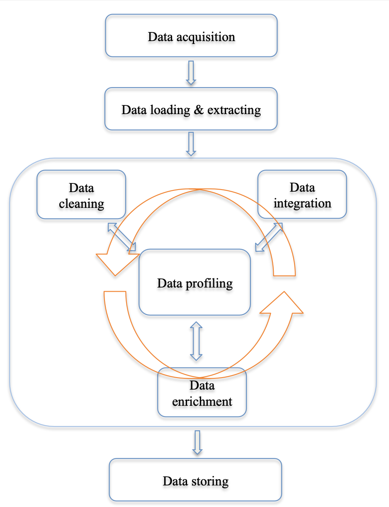

# Week1: Introduction to data wrangling

## Data acquisition

Gather data from different resources, e.g., the web, sensors, and conventional databases via API requests (e.g., Twitter’s API and Google API), web scraping (acquiring data from the Internet through many ways other than API access), etc. Tools used include various python package, pandas, R, etc.

## Data loading & extracting

Load and parse data stored in many different formats, like XML, JSON, CSV, natural language text, etc. Tools used include, for instance, BeautifulSoup (one of many python packages for parsing XML/HTML), regular expressions, NLTK (a python package for natural language processing).

## Data cleaning

Diagnose and handle various data quality problems. Performing data cleaning we need a set of operations that impute missing values, resolve inconsistencies, identify/remove outliers, unify data formats and other problems discussed in previous slides.

## Data integration

Merge data from different resources to create a rich and complete data set. It involves a set of operations that resolve related issues, such as data duplication, entity matching, and schema matching.

## Data profiling

Utilises different kinds of descriptive statistics and visualisation tools to improve data quality. The data profiling process might uncover more data quality problems, and suggests more operations for data cleaning and data integration.

## Data enrichment

Enrich existing data by feature generation, data transformation, data aggregation and data reduction, etc.

## Data storing

Finally store the clean data in various formats, which are easily accessible by downstream analysis tools.

## Documenting the process :exclamation::exclamation::exclamation:

We should also keep a detailed description of all data manipulations applied in the above tasks and generate a proper code book that describes each variable and its values in the clean data.

- Why documentation: collaboration
- Collaboration tools: Jupyter notebook, Github, etc.

