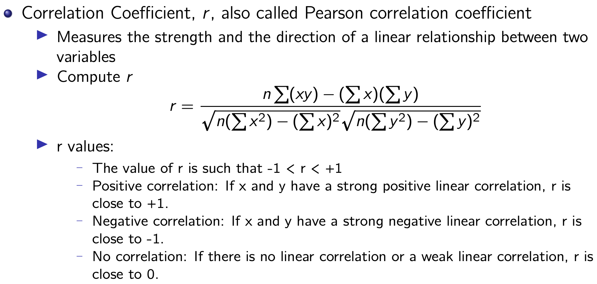

# Week10: Data Integration_2

## Data-Level Integration

Data-Level Integration: related to the integrated contents/values of data not the schema

Categories:

- Attribute-level (columns)
  - Redundancy
  - Correlation
- Tuple-level (rows)
  - Duplication
  - Inconsistency

## Data-Level Integration: Attribute-Level Issues

Problems: combining different data sources might result in a redundant representation

Examples

- When any of the attributes can be calculated from others
  - e.g., annual salary from fortnight payment
- When different values represent the same attribute but with different units
  - e.g., weight in kg and lb

Techniques to find correlation between attributes

- Chi-square Test for categorial varaibles
- Correlation Coefficient for numerical attributes

## Attribute-Level Issues: Chi-Sqaure Test

Chi-square test for categorial variables

- Test for independence compares two variables in a contingency table to see if they are related.
- Hypothesis statements:
  - Null Hypothesis: The two categorical variables are independent.
  - Alternative Hypothesis: The two categorical variables are dependent.
- The chi-square test statistic

## Attribute-Level Issues: Correlation Coefficient

## Data-Level Integration: Tuple-Level Integration

- Duplicates
  - Two or more rows (i.e., tuples) refer to the same object.
- Inconsistent update
  - Duplicated records are not updated simultaneously.
- Issues with tuple-level integration
  - Formatting convertors
  - Different naming conventions
- Tuple Matching methods
  - String Matching
  - Data Matching