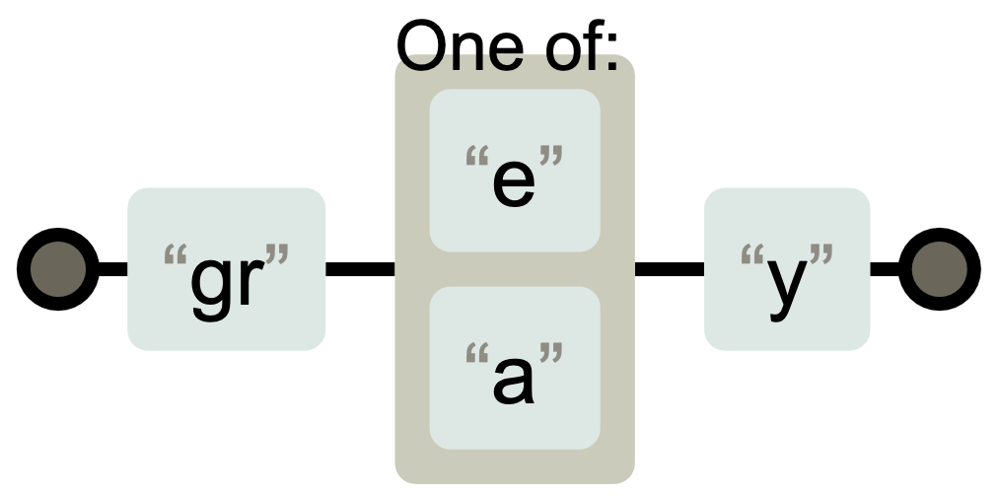
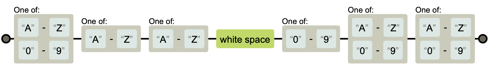
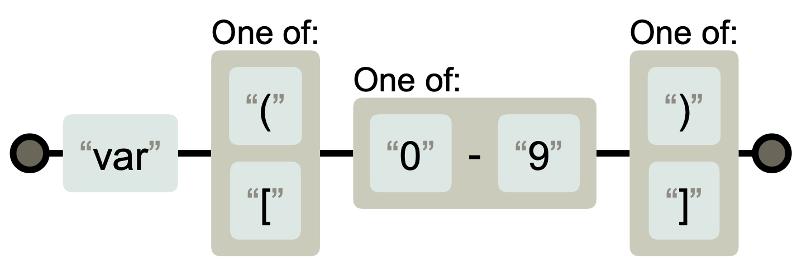

# Week2: Regular Expression

:point_right: A regular expression is a set of symbols that describes a text pattern.

Why regular expressions?

- Regular expressions are useful in finding, replacing and extracting information from text, such as log files, HTML/XML files, and other documents
  - Search a document for color or neighbor with or without ’u’
  - − Covert a tab-delimited file to a comma-delimited file
  - Find duplicated words in a text
  - Search and replace “Bob” and “Bobby” with “Robert”

- Regular expressions are useful in verifying whether input fits into the text pattern, such as verifying
  - phone numbers: Does a phone number have the right number of digits?
  - emails: Is an email address in a valid format?
  - date: Is a date in the right format? Does the month exceed 12?

## Character sets: [ . . . ]

[ . . . ] indicate a set of characters

- Matches any one of several characters in the set, but only one
- The order of characters does not matters.

Assume that we are going to match the following two words: **grey gray**

The regular expression is `gr[ea]y`, and it does not match grAy, graay, and graey.

## Character ranges: [a − zA − Z] and [0 − 9]

Assume that we are going to match victory car plate numbers, for example **XRA 000, 1AA 1AA**

Note the letters can be from A to Z, and the numbers can be from 0 to 9. What the regular expression should be?

Character ranges can be indicated by giving two characters and separating them by a `-`. Example:

- [0−9]
- [a−z]or[A−Z]

:exclamation::exclamation::exclamation: **Caution**

- [50 − 99] is not all numbers from 50 to 99, it is the same as [0−9].

`[A-Z0-9][A-Z][A-Z]\s[0-9][A-Z0-9][A-Z0-9]`

## Negative character sets: [ ˆ . . . ]

Assume that we are going write a regular expression that matches only the live animals: **hog dog bog**

Question: what is the regular expression?

[ ˆ . . . ]: If the first character of the set is `ˆ`, all the characters that are not in the set will be matched.

- `[ˆb]og` matches “hog" and “dog", but not “bog".
- Caution:
  - Does see[^mn] match “see”?
  - Does see[^mn] match “see ”?

## Metacharacters inside character sets: [.+]

Assume that we are going to match the following two strings: **var(9), var[0]**

Now, we need to match () and [ ], how can we do that?

Metacharacters inside character sets are already escaped. In other words they lose their special meaning inside sets.

- Example: `h[ai.u]t` matches “hat”, “h.t”, but not “hot”

Exceptions: `]`, `-`, `ˆ` and `\`that do need to be escaped.

:point_right: `var[([][0-9][)\]]`

## Shorthand character sets

| Shorthand | Meaning | Equivalent |
| --- | ----------- | ---|
| \d | matches any decimal digit from 0 to 9 | [0-9] |
| \w | matches any word character | [a-zA-Z0-9_] |
| \s | matches any white space character | [ \t\n\r] |
| \D | matches any non-digit character | [^0-9] |
| \W | matches any non-alphanumeric character | [^a-zA-Z0-9_] |
| \S | matches any non-whitespace character | [^ \t\n\r] |

Examples:

- `\d\d\d\d` matches four-digit numbers, such as “2016”, but not text.
- `\w\w\w` matches three word characters, such as “abc”, “123” and “d_b”
- `\w\w\s\w` matches “ab c” but not “a bc”.
- `[\w]-[\w]` matches two characters separated by a hyphen.
- `[^\d]` is the same as [\D]

:yellow_heart: Caution :yellow_heart:

Is `[^\d\s]` the same as `[\D\S]`?