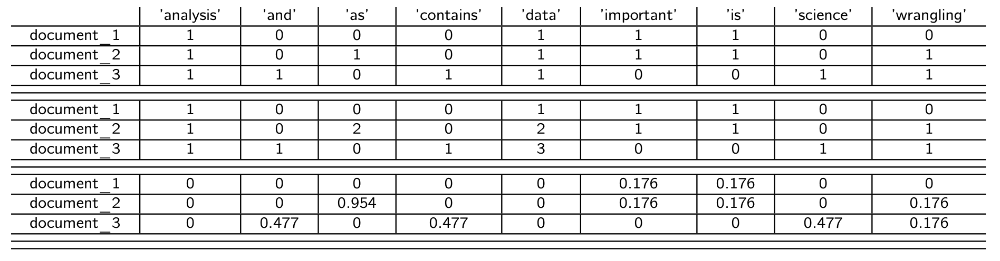
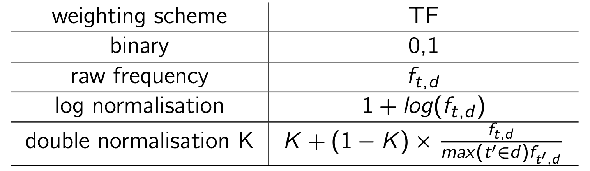
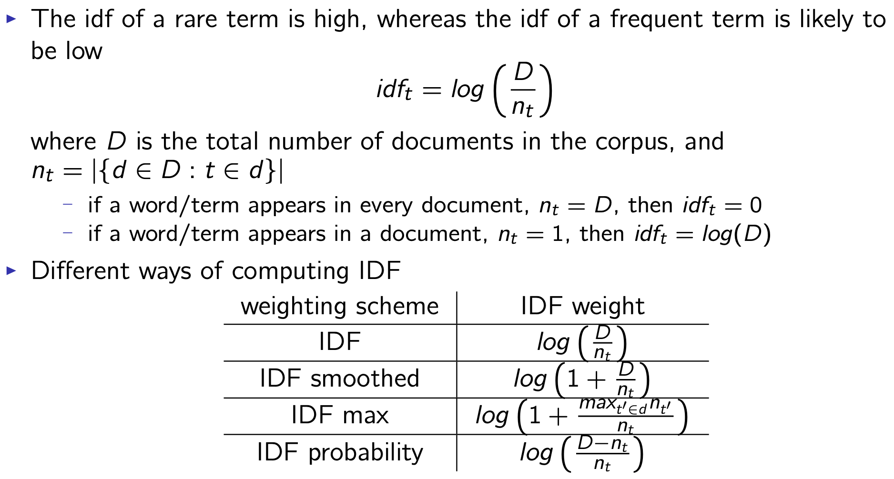
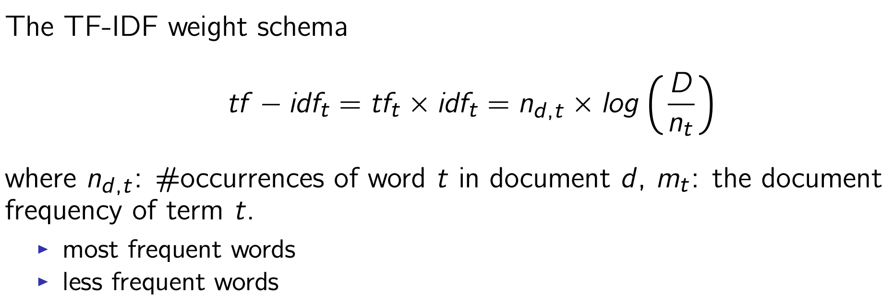

# Week5: Text Pre-Processing_2

Outline:

- Inverted Index
- Vector Space Model
- TF-IDF
- Collocations

## Inverted Index

To build an inverted index

1. Collect the documents to be indexed.
2. Tokenize the text, turning each document into a list of tokens
3. Do linguistic preprocessing, producing a list of normalized tokens, which are the indexing terms
4. Index the documents that each term occurs in by creating an inverted index, consisting of a dictionary and postings.

## Vector Space Model

**VSM:** each text document is represented as a vector where the elements of the vector indicate the occurrence of words within the text

*V(d) = [W1,d,W2,d,W3,d,...,WN,d]*

where

- N: the size of the vocabulary
- Wn,d : the weight of the n-th term (in the vocabulary) in document d 

Examples:

- document_1: "Data analysis is important."
- document_2: "Data wrangling is as important as data analysis."
- document_3: "Data science contains data analysis and data wrangling."

Vector representation

### Euclidean Distance

### Cosine Similarity

Notation:

- **Vn(d):** the weight of the n-th vocabulary term in document d
- **·:** indicates inner product
- **|V(d)|:** Euclidean length

The cosine similarity of d1 and d2 is equivalent to the cosine of the angle between d1 and d2.

- Cosine is a monotonically decreasing function of the angle for the interval [0◦, 180◦]

### Bag of Words

The Bag-of-Words assumption:

- The order of the words in a document does not matter.
- Not a problem for many text analysis tasks, such as document classification and clustering
  - A collection of words is usually sufficient to differentiate between semantic concepts of documents.
- Not a universal solution for, such as information extraction, POS tagging and many other NLP tasks, where the order of words does matter.

Consideration of using VSM:

- The dimensionality of the vectors in VSM.
- How the compute the weights of words in each document.
  - binary values
  - counts
  - TF-IDF weights

## Term Frequency

**TF:** the number of occurrences of a word in a document. 

How well does a word represent its document?

- frequent (non-stop) words are thematic
- if a words t appears often in a document, then a document containing t should be similar to that document.

:cupid: Different ways of computing TF:

:hand: Problems:

- All words are considered equally important.
- Certain terms have little or no discriminating power in, for example, text classification.
  - All the medical documents contain words "patient" and "disease"
  - All the patents contain words like "claim", "embodiment ", etc.
- Can we scale down the term weights of terms ?

## Inverse Document Frequency

**IDF:** Inverse document frequency

## TF-IDF

