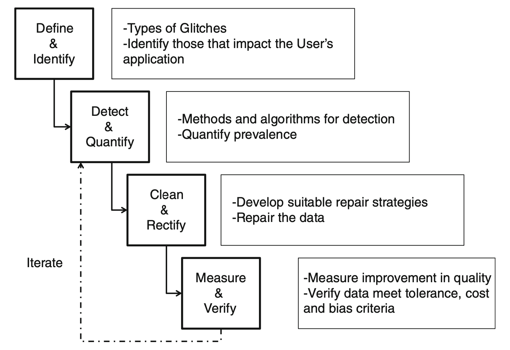

# Week6: Data Cleansing_1

## Data Cleansing

**Data Cleansing:** A process of detecting and removing errors and inconsistencies from data in order to improve the quality of data.

## Data Anomalies (i.e., Glitches or Errors)

Data Anomalies describes the distortion of the data because of any of the problems that might encounter in the life cycle of data that includes its capture, storage, update, transmission, access, archive, restore, deletion and purge.

Some common data quality problems:

- Missing data
- Inconsistent and faulty data
- Outliers
- Duplicates

## Data Anomaly Classification

### Source-based

www.google.com

### Type-based

#### :yellow_heart: ***Syntactical Anomalies:*** format and values

- **Lexical errors:** data format discrepancies in terms of database; spelling errors, typos in terms of linguistics.
- **Domain format errors:** inconsistent value format of an attribute, e.g., Buntine, Wray Lindsay v.s. Wray L. Buntine
- **Irregularities:** the non-uniform use of values, units and abbreviations?e.g., salary in difference currencies.

#### :blue_heart: ***Semantic Anomalies:*** comprehensiveness and non-redundancy

- Integrity constraint violations
- Contradictions: violation of dependencies between attributes, e.g., AGE and DOB.
- Duplicates: observations representing the same entity.
- Invalid observations

#### :green_heart: ***Coverage Anomalies:*** missing values

- Missing values: due to omissions while collecting the data
- Missing observations

## Taxonomy of Dirty Data

Dirty data manifests itself in three different ways:

- **missing data**
  - Missing data where there is no Null-not-allowed constraint
  - Missing data where Null-not-allowed constraint should be enforced
- **not missing but wrong data**
  - Integrity constraints
    - violation of data type constraint, including value range
    - violation of non-null uniqueness constraint, i.e., duplicated data
    - violation of referential integrity
    - Wrong categorical data
    - Outdated temporal data
    - Inconsistent spatial data
  - Data Entry error involving a single table
    - Data entry error involving a single field: erroneous entry, misspelling, extraneous data
    - Data entry error involving multiple fields: entry into wrong fields, wrong derived-field data
- **not missing and not wrong but unusable**
  - Different data for the same entity across multiple databases
  - Ambiguous data due to: the use of abbreviation (Dr. for doctor or drive),
  - Incomplete context (e.g., Sydney of Australia or Canada)
  - The use of abbreviation (e.g., ste for suite, rd for road, st for street, etc)
  - Alias/nick name (e.g., Bill Clinton, President Clinton)
  - Encoding formats (e.g, ASCII, ...)
  - Representations (e.g., negative number, precision, fraction)
  - Measurement units (e.g., data, time, currency, weight, area, etc.)
  - Uses of special characters (e.g., space, dash, parenthesis in phone numbers) in concatenated data

## Data Cleansing Blueprint

1. **Data Auditing** (or Analysis): detect errors and inconsistencies in the data
   - Data profiling: focuses on the instance analysis of individual attributes
   - Data mining: descriptive data mining, e.g., clustering, summarisation, association discovery, etc.
2. **Definition of transformation workflow**: define a sequence of operations on the data, used to detect and eliminate anomalies
   - Early data cleaning steps: correct single-source instance problems
   - Later data cleaning steps: deal with schema/data integration and clean multi-source problems.
3. **Verification**: test and evaluate the correctness and effectiveness of a transformation workflow
4. **Data transformation**: Execute the transformation steps
5. **Post-processing and controlling**: inspect the results to verify the correctness of the specified operations.

## Exploratory Data Analysis

Two types of variables:

- categorial variable
- numerical variable

Two types of EDA

- Non-graphical: summary statistics
- Graphical: various plots

EDA

- Univariate
- Multivariate

### Univariate non-graphical methods: Categorial data

**Categorical variables**: values or observations that can be sorted into groups or categories.

- Examples: Sex, Eye colour and blood type.

The characteristics of interest for a categorial variable

- the range of values
- the frequency of occurrence for each value
- univariate non-graphical technique: tabulation of the frequencies

### Univariate non-graphical methods: Quantitative data

**Numerical variables:** values or observations that can be measured, and these numerical values can be placed in ascending or descending order.

- Examples: salary, height, weight, etc.

The characteristics of the population distribution of a numerical variable

- **center tendency**: "location" of a distribution, dealing with typical or middle values.
  - **Mean**: the arithmetic average of a set of values
  - **Median**: the middle value after all the values are put in an order list.
  - **Mode**: the most frequent occurring value in a set of values
- **spread**: an indicator of how far away from the centre we are still likely to find data values.
  - Range: the difference between the smallest and largest values in the data set.
  - Standard Deviation and Variance
  - The Interquartile Range
  - The inter-quartile range (IQR)
- **shape**: Skewness and Kurtosis
- **outliers**: values that are outside of the areas of a distribution that would commonly occur.

The characteristics of the population distribution of a numerical variable

- center tendency
  - **Mean**: the arithmetic average of a set of values
  - **Median**: the middle value after all the values are put in an order list.
  - **Mode**: the most frequent occurring value in a set of values

### Univariate graphical methods

- **Histograms**: a quick way of learning the characteristics of your data, including central tendency, spread, shape, outliers, etc.
- **Boxplots** (or Box-and-Whiskers Plot): display five-point summaries and potential outliers in graphical form

### Multivariable non-graphical methods: Categorical data

**Cross-tabulation**: a two-way table with column headings that match the levels of one variable and row headings that match the levels of the other variable, then filling in the counts of all subjects that share a pair of levels.

### Multivariable non-graphical methods: Quantitative variables

- Covariance
- Correlation

### Multivariable graphical methods

- Side-by-Side boxplot
- Scatterplot