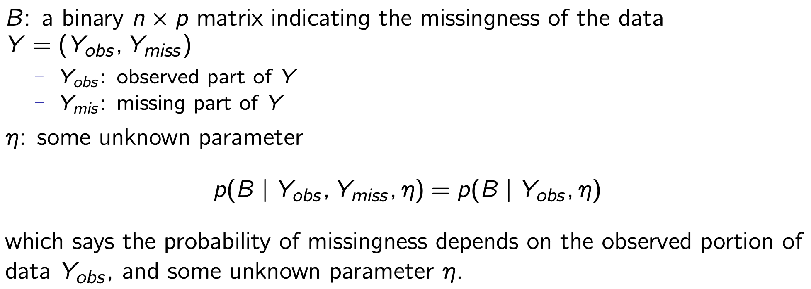
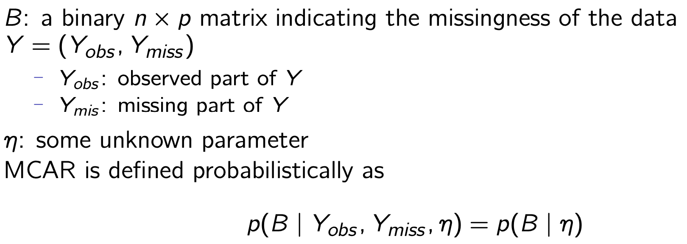
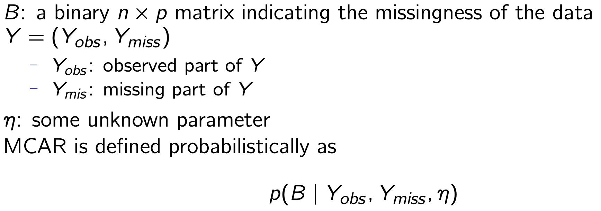
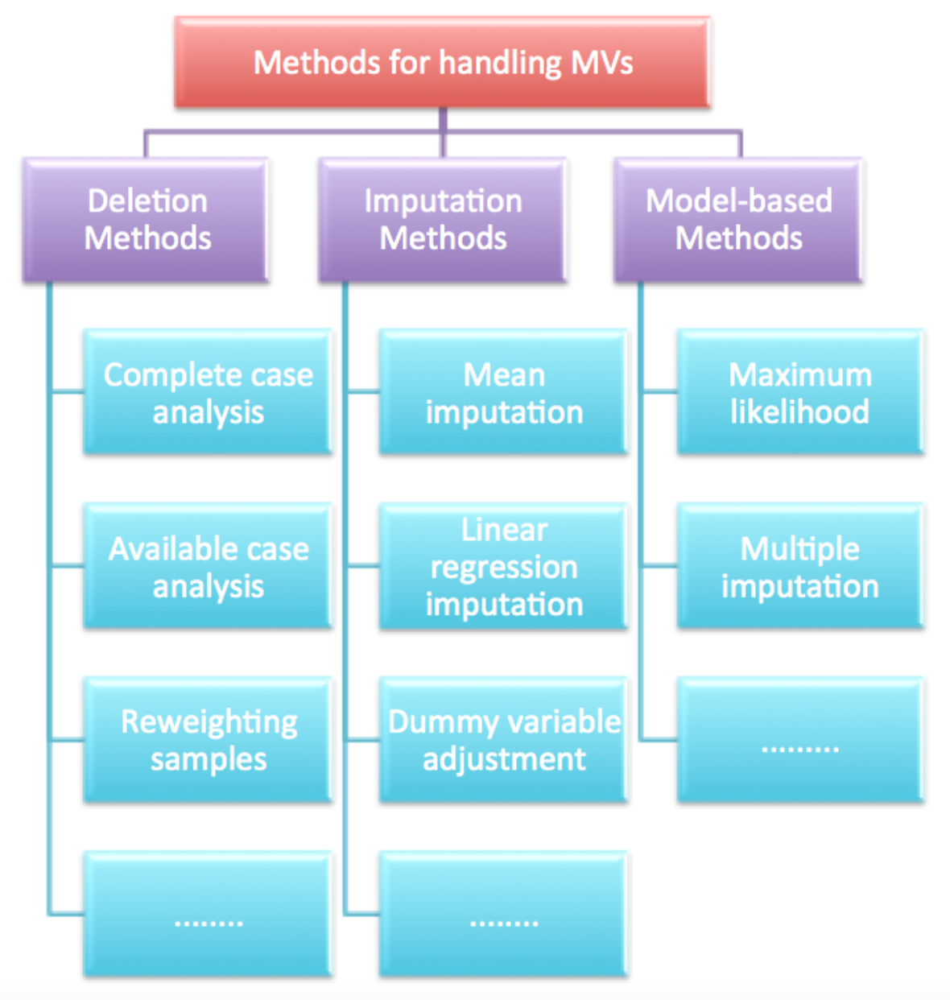

# Week7: Data Cleansing_2

- Missing Data Mechanisms
- Missing Data Pattern
- Methods for Handling Missing Values

## Missing Data Mechanisms

:wave: Describe relationships between measured variables and the probability of missing data

:point_up: Deciding upon the method for analysing missing values requires understanding about both the reasons for the missing values and the nature of the data for the missing observations.

:seedling: Three different missingness mechanisms:

- Missing at random
- Missing completely at random
- Missing not at random

### Missing at Random (MAR)

**MAR**: the probability of missing data on a variable is related to some other measured variable (or variables) in the analysis model but not to the values of the variable itself.

Practical issue: no way to confirm that the probability of missing data on Y is solely a function of other measured variables.

Examples

1. A psychologist is studying quality of life in a group of cancer patients and finds that elderly patients and patients with less education have a higher propensity to refuse the quality of life questionnaire.
   - The missingness in the quality of life is related to the age and education

2. An educational researcher is studying reading achievement and finds that Hispanic students have a higher rate of missing data than Caucasian students
   - The missingness in reading achievement is related to the ethic groups of students.

### Missing Completely at Random (MCAR)

**MCAR**: the probability of missing data on a variable is unrelated to other measured variables and is unrelated to the values of the variable itself.

MCAR is a more restrictive condition than MAR.
Both MAR and MCAR could be ignorable.

#### Test MCAR

Separate the missing and the complete cases on a particular variable and examine group mean differences on other variables in the data set.

- Univariate T-test Comparisons: It separates the missing and the complete cases on a particular variable and uses a T-test to examine group mean differences on other variables in the data set.
  - A non-significant t test: the data are MCAR
  - A significant T statistic (or alternatively, a large mean difference): the data are MAR or MNAR.
- Little’s MCAR Test: A multivariate extension of the t-test approach that simultaneously evaluates mean differences on every variable in the data set
  - A global test of MCAR that applies to the entire data set

### Missing Not at Random (MNAR)

**MNAR**: the probability of missing data on a variable is related to the values of the variable itself, even after controlling for other variables

Examples

- Students with poor reading skills have missing test scores because they experienced reading comprehension difficulties during the exam.
  - The missingness in reading achievement is related to reading skills.
- A number of patients in the cancer trial become so ill (e.g., their quality of life becomes so poor) that they can no longer participate in the study.
  - The missingness in the quality of life is related to the quality of life itself.

## Missing data Patten

A ***missing data pattern*** refers to the configuration of observed and missing values in a data set.

- The **univariate pattern** has missing values isolated to a single variable.
- A **monotone missing data pattern** is typically associated with a longitudinal study where participants drop out and never return.
- a **general pattern** has missing values dispersed throughout the data matrix in a haphazard fashion.

## Methods for handling missing values

### Deletion method: List-wise Deletion

**Listwise deletion** (also known as **complete-case analysis**) discards the data for any case that has one or more missing values.

Considerations

- The primary benefit of list-wise deletion is convenience, producing a common set of cases for all analyses.
- It assumes MCAR data and can produce distorted parameter estimates when this assumption does not hold.
- Deleting the incomplete data records can produce a dramatic reduction in the total sample size, the magnitude of which increases as the missing data rate or number of variables increases.

### Deletion method: Pairwise Deletion

**Pairwise deletion** (also known as **available-case analysis**) attempts to mitigate the loss of data by eliminating cases on an analysis-by-analysis basis.

Considerations:

- It requires MCAR data and can produce distorted parameter estimates when this assumption does not hold.
- It is dependent on the magnitude of correlations that exist between variables.
- It can produce estimated covariance matrices are outside of the range of -1.0 to 1.0, which causes estimation problems for multivariate analyses that use a covariance matrix as input data.
- It is lack of a consistent sample base: cause problems in computing standard errors and covariance.

## Single Imputation methods

Single imputation: generates a single replacement value for each missing data point.

- Yields a complete data set
- Produces biased parameter estimates
- Underestimates standard errors

Methods

- Mean Imputation
- Regression Imputation
- Stochastic Regression Imputation

### Arithmetic mean imputation

**Arithmetic mean imputation** (also referred to as **mean substitution**) takes the seemingly appealing tack of filling in the missing values with the arithmetic mean of the available cases.

### Regression imputation

**Regression imputation** replaces missing values with predicted scores from a regression equation.

:sunny: Basic idea: use information from the complete variables to fill in the incomplete variables.

:two_hearts: Two steps: :two_hearts:

1. Estimate a set of regression equations that predict the incomplete variables from the complete variables.
2. Generate predicted values for the incomplete variables

### Stochastic regression imputation

**Stochastic regression** imputation add random residuals to the predicate values generated by standard regression imputation.

:sunny: Basic idea: to restore lost variability to the data and effectively eliminate the biases associated with standard regression imputation methods.

Steps:

1. Estimate a set of regression equations that predict the incomplete variables from the complete variables.
2. Generate predicted values for the incomplete variables
3. Add a normally distributed residual term to each predicted score
