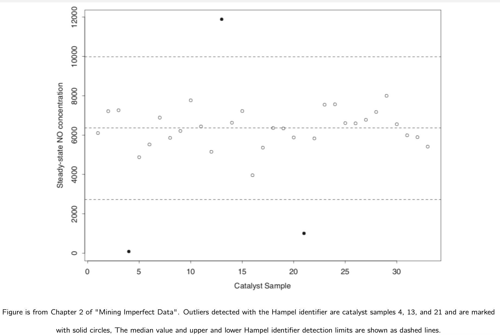
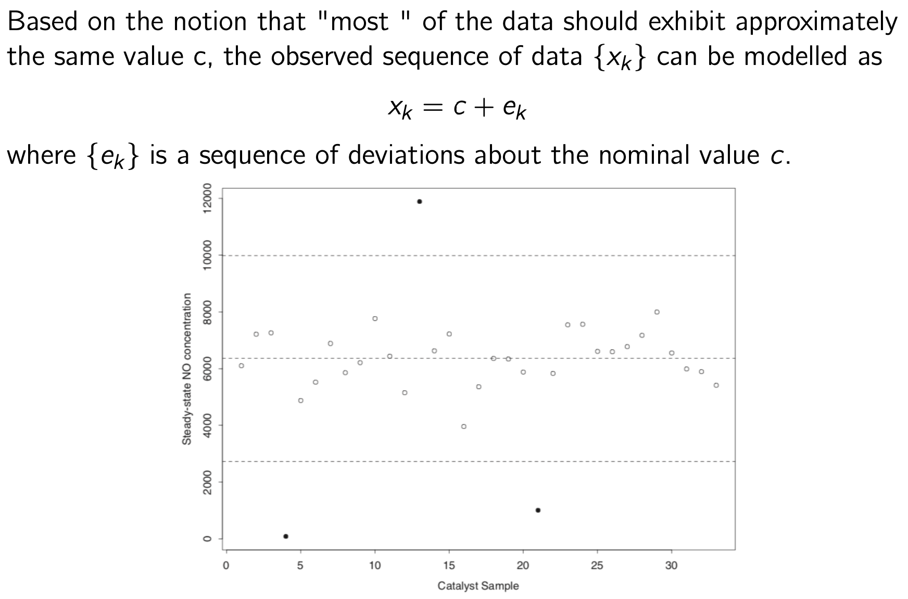
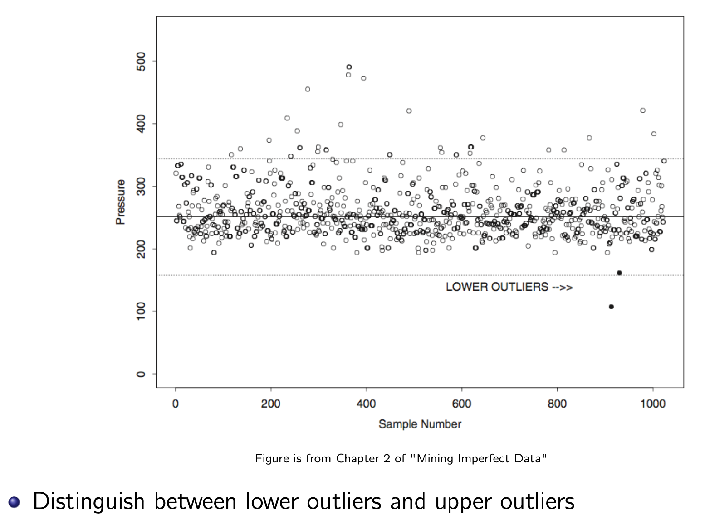
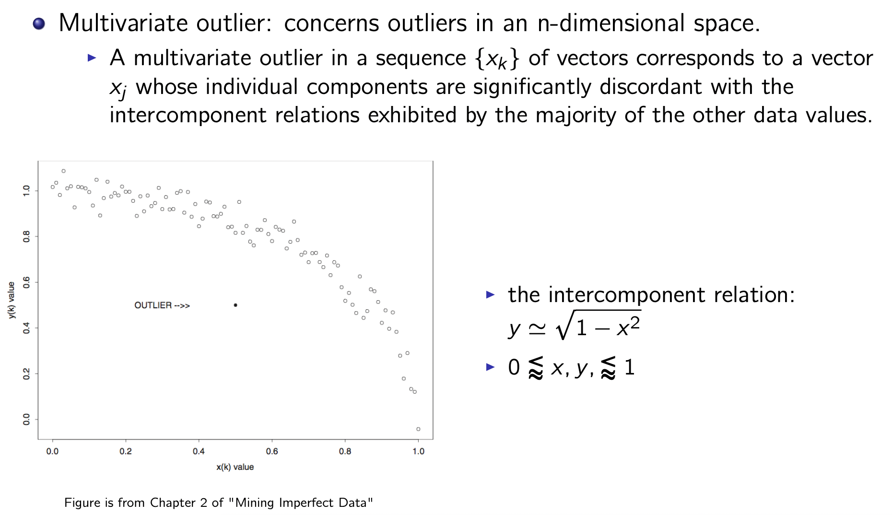
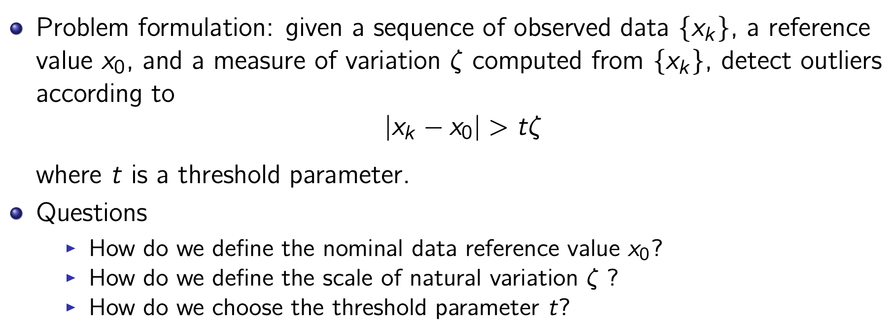
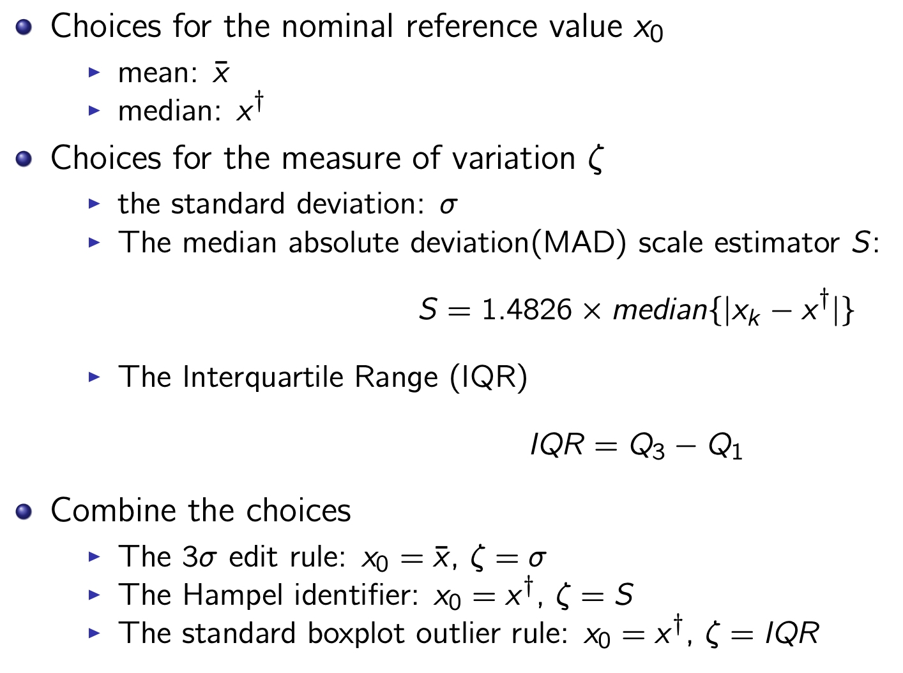

# Week8: Data Cleansing_3

Outlier

- Types of outliers
- Univariate Outlier Detection
- Multivariate Outlier Detection

## Outliers

What is an outlier?

- Definition of Hawkins :man: : “An outlier is an observation which deviates so much from the other observations as to arouse suspicions that it was generated by a different mechanism” (Hawkins, D. 1980. Identification of Outliers. Chapman and Hall.)
- Definition of Pearson :older_man: : “An outlier is a data point that appears to be inconsistent with the nominal behavior exhibited by most of the other data points in a specified collection.”

---

An outlier often contains useful information about abnormal characteristics of the systems and entities that impact the data generation process.

- *Intrusion detection systems*: unusual behaviour shown in the operating system calls, network traffic, or other user action.
- *Credit-card fraud*: Unauthorized use of a credit card may show different patterns, such as buying sprees from particular locations or very large transactions.
- *Medical Analysis*: Unusual patterns in MRI, PET and ECT data typically reflect disease conditions
- *Law enforcement*: Determining fraud in financial transactions, trading activity, or insurance claims typically requires the identification of unusual patterns in the data generated by the actions of the criminal entity.

Outliers' impact:

- Outliers can increase the error variance and reduces the power of statistical tests.
- If the outliers are non-randomly distributed, they can decrease normality.
- Outliers can bias or influence estimates that may be of substantive interest
- Outliers can also impact the basic assumption of Regression, ANOVA and other statistical model assumptions.

## Types of outliers

- :boy: **Univariate outlier**: concerns the distribution of a single variable
- :couple_with_heart: **Multivariate outlier**: concerns outliers in an n-dimensional space

### Univariate Outliers

### Multivariate outliers

### How to detect Univariate Outliers

### Three Outlier Detection Methods

