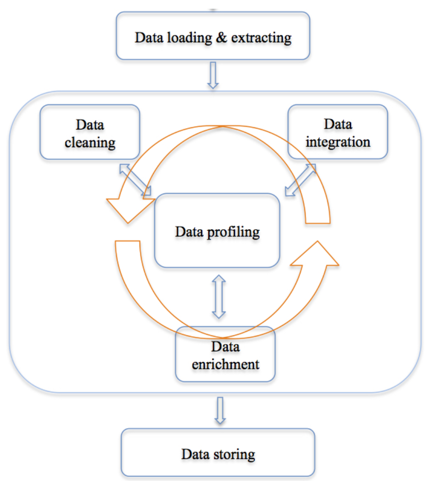
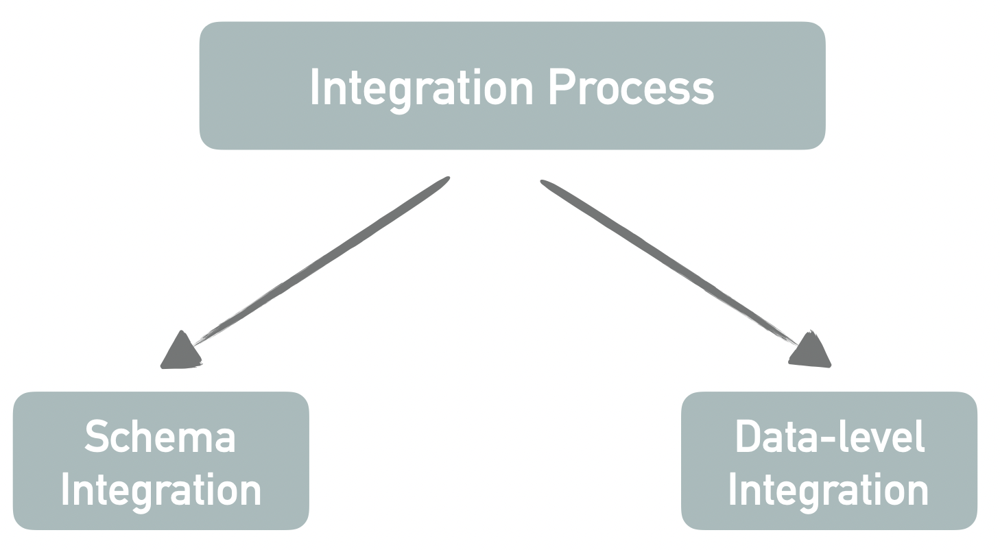
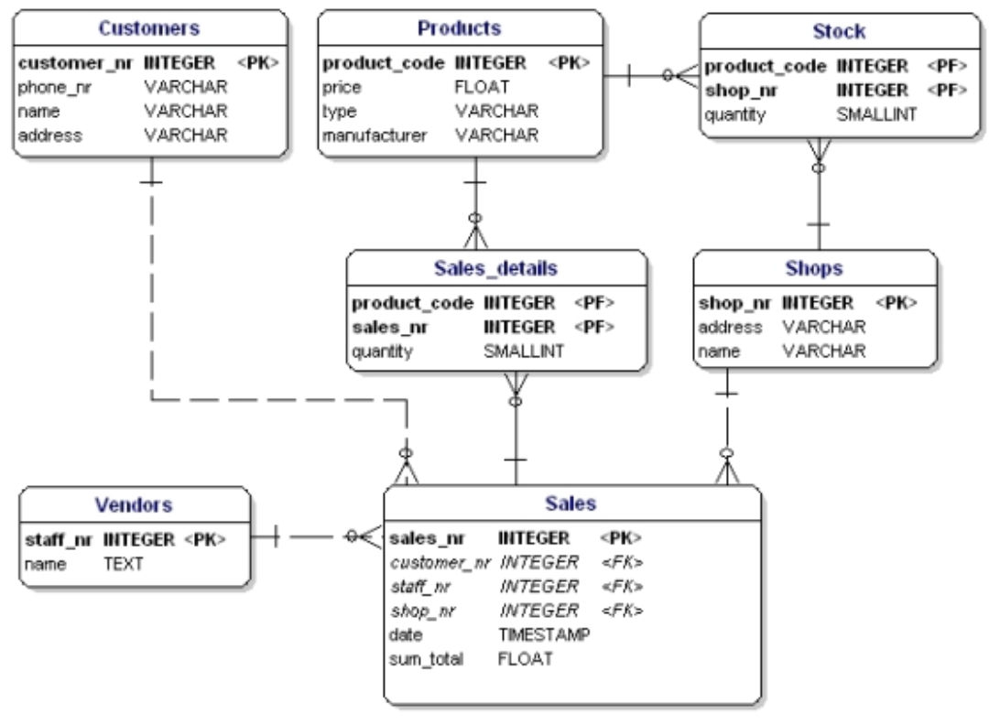
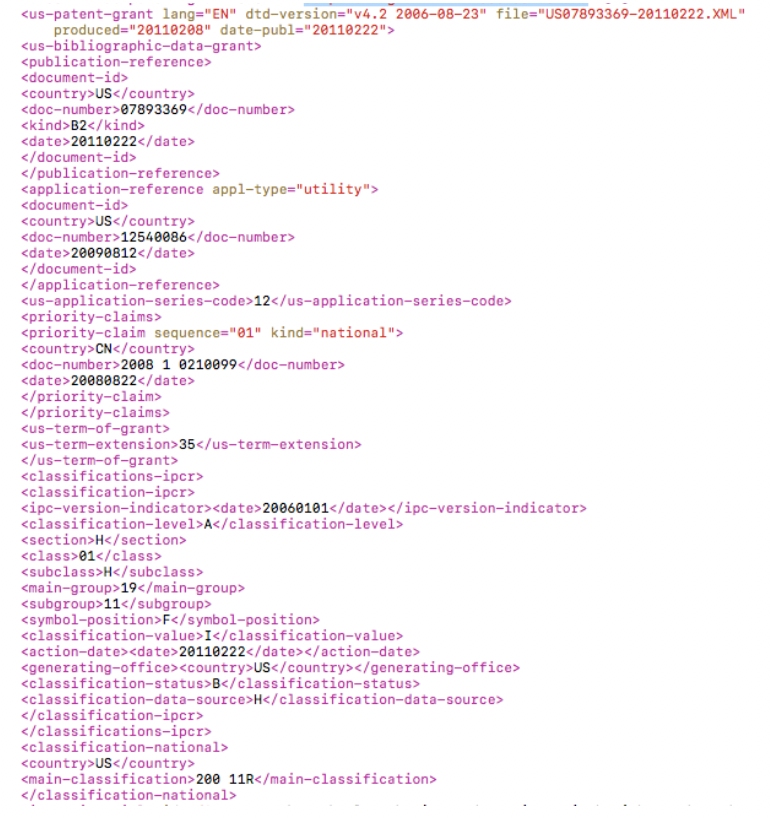
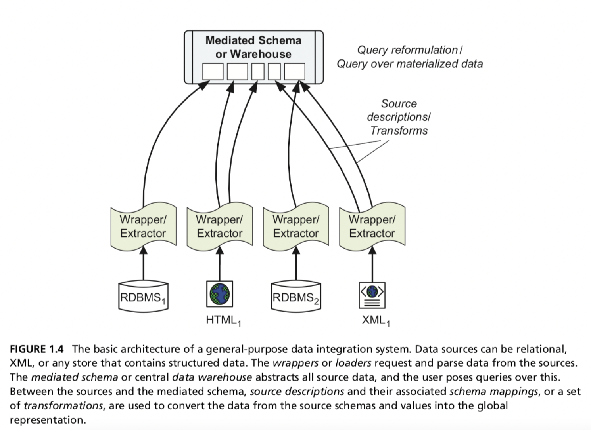
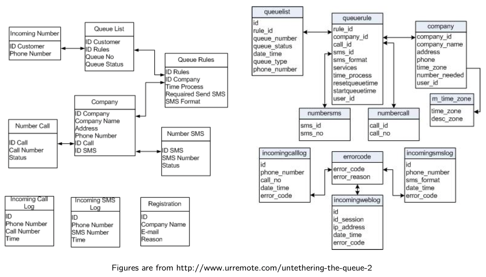
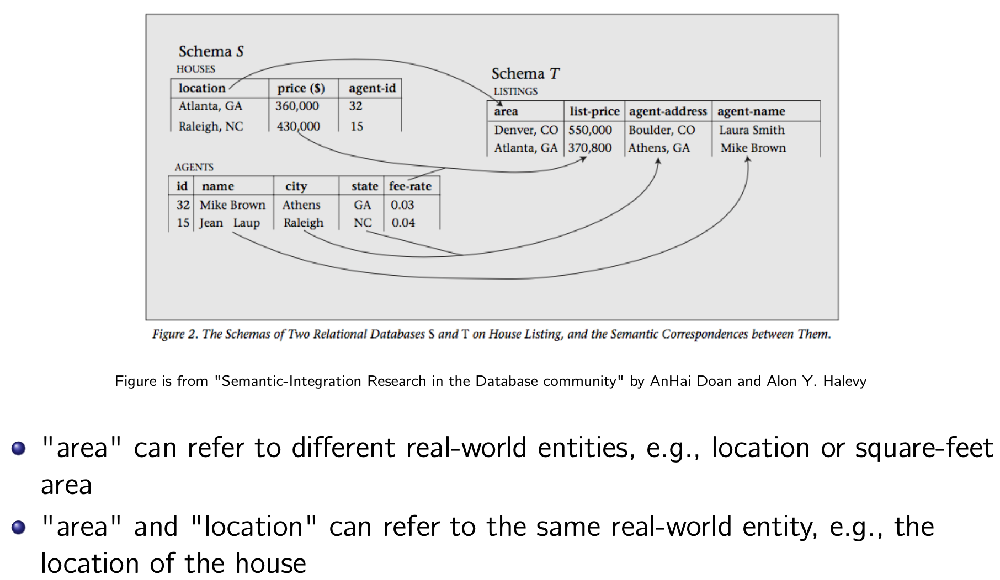

# Week9: Data Integration_1

Recap: data wrangling process

## Data Integration: Definition

A process in which **heterogeneous data** is retrieved and combined as an **incorporated** form and structure.

Data fusion: the integration of data and knowledge from several sources

- The Human Resources Department needs to be able to query for all of its employees, whether in the United States or in Europe.
- Combining data from the HelpLine database and the Sales database will help FullServe identify issues in their products and services early on,.
- Customer support hotline: a customer representative might need to know customers Internet service, products purchased, call notes.

:sparkling_heart: Goal: create a single representation that provides a more accurate description than any of the individual data sources

## Why Data Integration is Challenging

- **Heterogeneous data**
  - Data coming from different sources is often developed independently (e.g., different schema, different objectives)
- **Various formats**
  - Text, web logs, social networks, sensors, astronomy, genomics, medical records, surveillance, etc.
- **Incompatible Taxonomies**
  - Different object identity and separate schema
    - Different definitions of a customer, an account, etc.
- **Time synchronisation**
  - Each source might have a time window that is different from each other.
  - Synchronisation of data collected in different time windows
- **Dealing with legacy data**
  - Historical data stored in legacy form, such as IMS, spreadsheets, and other ad-hoc structure
  - Combine historical data with modern data
- **Abstraction levels**
  - Different data sources might provide data at different level of abstraction, e.g.,
    - suburb level v.s. state level
    - annual v.s. weekly
- **Data Quality**
  - Data is often erroneous, and combining data often aggravates the problems. Erroneous data has potentially devastating impact on the overall quality of the integrated data.
- **The number of sources**
  - e.g., web-scale integration.

## Integration Process

### What does the schema look like?

Relational databases:

- A schema specifies a set of tables
- A table contains a set of attributes associated with their data types

- Data models like XML and JSON
  - A schema is defined as a set of tags, classes and properties

- Data science
  - A data schema is defined as the representation of the data arrangement, relationships and contents.

### Why do we need schema integration?

## Schema Mapping

The linkage between each data source and the mediate schema is done through semantic mapping

- Specifies how attributes in the sources correspond to attributes in the mediated schema (when such correspondences exist)
- Specifies how the different groupings of attributes into tables are resolved.
- Specifies how to resolve schema conflict from different sources

## Problems with Schema Integration

### Structure conflicts

- Inconsistencies in the data structure among schemas, which include
  - Different data source origins: Data can be represented in a structure form (e.g., XML, HMTL, JSON, semistructured, or completely unstructured data.
- Inconsistencies among the set of elements inside the different schemas

### Naming conflicts

- homonyms vs synonyms
  - The same name is used for different objects.
  - Different names are used for the same object.

- Examples
  - Homonyms: ID can refer to customer ID, product ID, store ID, etc.
  - Synonyms: Customer ID and Client ID can refer to the same real world object, i.e., customer/client.

### Entity resolution/conflict resolution

- **Different units**
  - Temperature units: Celsius and Fahrenheit
  - Currencies
- **Data type heterogeneity**
  - Same kind of attributes with different data types
    - phone number can be stored as string in one database and integer in another databse
- **Value heterogeneity**
  - The use of Abbreviations: Professor v.s. Prof, Street v.s. St, Road v.s. Rd
- **Semantic heterogeneity:** differences in meaning and interpretation of data values1
  - Naming
    - Case sensitivity
    - Synonyms/Homonyms
    - Acronyms
  - Generalisation/Specialisation: one schema may refer to "phone" but the other schema has multiple elements such as "home phone", "work phone" and "cell phone"
- **Level of abstraction:** different aggregation levels for an attributes
  - Address can be split into multiple fields, street number, street name, suburb, city, post-code, etc.
- **Different points of time**
  - Fortnight and monthly payment

## Schema Integration: semantic matching

Semantic matching: relates a set of elements in schema S to a set of elements in schema T.

- One-to-One match
  - Movies.title ≈ Items.name
  - Movies.year ≈ Items.year
  - Product.rating ≈ Items.classification
- One-to-Many match
  - Items.price ≈ Products.basePrices × (1 + Locations.taxRate)

## Schema Integration: Name-Based Matcher

Name-Based Matcher: compares the names of attributes (or column headers) in the hope that the names convey the true semantics of the elements.

- Split names according to certain delimiters, such as capitalization, numbers, or special symbols.
  - ClientName ⇒ Client Name
  - saleLocID ⇒ Sale Loc ID
- Expand known abbreviations or acronyms
  - loc ⇒ location
  - cust ⇒ customer
  - St ⇒ Street
  - DOB ⇒ Date of Birth
- Expand a string with its synonyms
  - Location ⇒ Address
  - Cost ⇒ Price
- Expand a string with its hypernyms
  - product ⇒ book, DVD, etc.
- Remove articles, propositions, and conjunctions
- Exclude words like “in”, “at”

## Schema Integration: Instance-Based Matcher

Rule-based matching method

- Handcrafted rules exploit schema information such as element names, data types, structures, number of subelements, and integrity constraints.
- For DVD-vendor database:
  - All possible classification: G, PG, PG-13, R, etc
  - Given a new attribute, if most of its values appear in the list above.
- Advantages
  - Relatively inexpensive, do not require training
- Disadvantages:
  - Cannot exploit data instances effectively (e.g., value format, frequently occurring values, etc.)

Instance-Based Matcher makes use of the data values.

- Learning-based matching method: learning techniques that can exploit both schema and data information.
  - Classification-based methods
  - (semi-)automated but Needs training